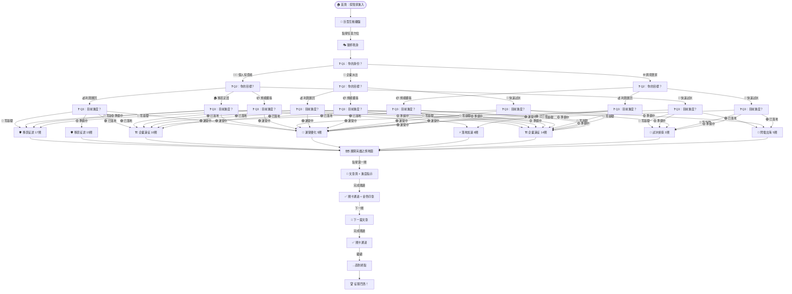
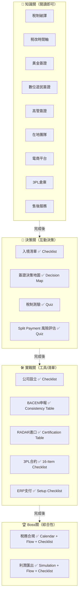
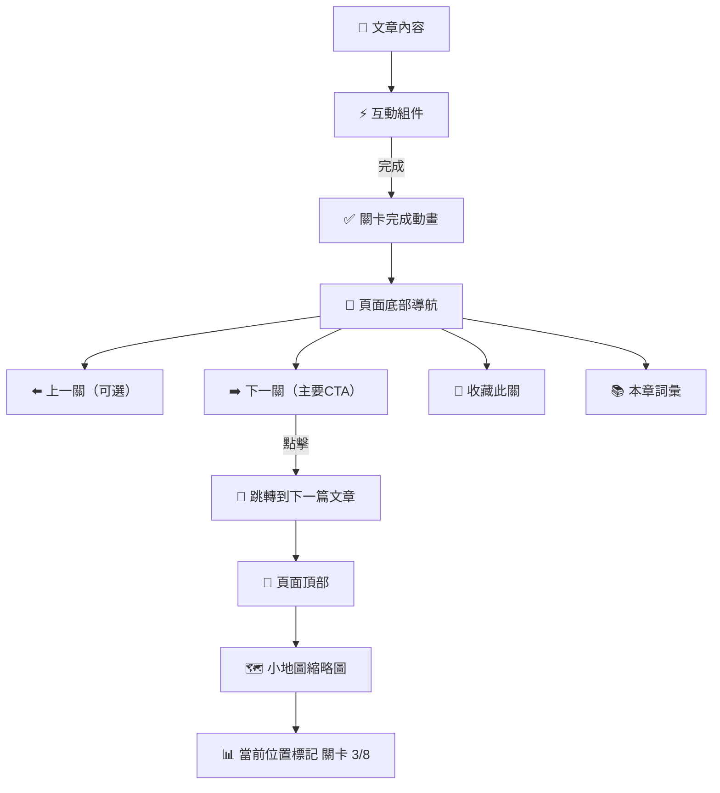

# 混合方案：互動流程圖

## 全局互動流程（軍師診斷 + 地圖展開）

```mermaid
graph TB
    Start(["🏠 首頁：探險家進入"]) --> Compass["🧭 巨型互動羅盤"]
    
    Compass -->|"點擊任意方位"| Advisor["🎭 軍師現身"]
    
    Advisor --> Q1["❓ Q1：你的身份？"]
    
    Q1 -->|"🧑‍💼 個人投資者"| Q2A["❓ Q2：你的目標？"]
    Q1 -->|"🏢 企業派出"| Q2B["❓ Q2：你的目標？"]
    Q1 -->|"🌐 跨境賣家"| Q2C["❓ Q2：你的目標？"]
    
    Q2A -->|"💰 利潤匯回"| Q3_1["❓ Q3：目前進度？"]
    Q2A -->|"🏠 移民定居"| Q3_2["❓ Q3：目前進度？"]
    Q2A -->|"📦 規模擴張"| Q3_3["❓ Q3：目前進度？"]
    Q2A -->|"🎯 快速試水"| Q3_4["❓ Q3：目前進度？"]
    
    Q2B -->|"💰 利潤匯回"| Q3_5["❓ Q3：目前進度？"]
    Q2B -->|"📦 規模擴張"| Q3_6["❓ Q3：目前進度？"]
    Q2B -->|"🎯 快速試水"| Q3_7["❓ Q3：目前進度？"]
    
    Q2C -->|"🎯 快速試水"| Q3_8["❓ Q3：目前進度？"]
    Q2C -->|"💰 利潤匯回"| Q3_9["❓ Q3：目前進度？"]
    Q2C -->|"📦 規模擴張"| Q3_10["❓ Q3：目前進度？"]
    
    Q3_1 -->|"🔵 零基礎"| Path1["🛡️ 移民征途 17關"]
    Q3_1 -->|"🟡 準備中"| Path2["🛡️ 移民征途 15關"]
    Q3_1 -->|"🟢 已落地"| Path3["🏗️ 企業遠征 10關"]
    Q3_1 -->|"🟣 運營中"| Path4["🔧 運營優化 5關"]
    
    Q3_2 -->|"🔵 零基礎"| Path1
    Q3_2 -->|"🟡 準備中"| Path1
    Q3_2 -->|"🟢 已落地"| Path5["⚡ 落地加速 8關"]
    Q3_2 -->|"🟣 運營中"| Path4
    
    Q3_3 -->|"🔵 零基礎"| Path1
    Q3_3 -->|"🟡 準備中"| Path6["🏗️ 企業遠征 14關"]
    Q3_3 -->|"🟢 已落地"| Path3
    Q3_3 -->|"🟣 運營中"| Path4
    
    Q3_4 -->|"🔵 零基礎"| Path7["🎯 試水偵察 3關"]
    Q3_4 -->|"🟡 準備中"| Path7
    Q3_4 -->|"🟢 已落地"| Path8["🚀 閃電出海 5關"]
    Q3_4 -->|"🟣 運營中"| Path4
    
    Q3_5 -->|"🔵 零基礎"| Path6
    Q3_5 -->|"🟡 準備中"| Path6
    Q3_5 -->|"🟢 已落地"| Path3
    Q3_5 -->|"🟣 運營中"| Path4
    
    Q3_6 -->|"🔵 零基礎"| Path6
    Q3_6 -->|"🟡 準備中"| Path6
    Q3_6 -->|"🟢 已落地"| Path3
    Q3_6 -->|"🟣 運營中"| Path4
    
    Q3_7 -->|"🔵 零基礎"| Path7
    Q3_7 -->|"🟡 準備中"| Path8
    Q3_7 -->|"🟢 已落地"| Path3
    Q3_7 -->|"🟣 運營中"| Path4
    
    Q3_8 -->|"🔵 零基礎"| Path7
    Q3_8 -->|"🟡 準備中"| Path7
    Q3_8 -->|"🟢 已落地"| Path8
    Q3_8 -->|"🟣 運營中"| Path4
    
    Q3_9 -->|"🔵 零基礎"| Path6
    Q3_9 -->|"🟡 準備中"| Path6
    Q3_9 -->|"🟢 已落地"| Path5
    Q3_9 -->|"🟣 運營中"| Path4
    
    Q3_10 -->|"🔵 零基礎"| Path6
    Q3_10 -->|"🟡 準備中"| Path6
    Q3_10 -->|"🟢 已落地"| Path3
    Q3_10 -->|"🟣 運營中"| Path4

    Path1 --> Map["🗺️ 展開英雄之旅地圖"]
    Path2 --> Map
    Path3 --> Map
    Path4 --> Map
    Path5 --> Map
    Path6 --> Map
    Path7 --> Map
    Path8 --> Map
    
    Map -->|"點擊第一關"| Article1["📖 文章頁 + 進度指示"]
    Article1 -->|"完成閱讀"| Checkpoint["✅ 關卡通過 + 金色印章"]
    Checkpoint -->|"下一關"| Article2["📖 下一篇文章"]
    Article2 -->|"完成閱讀"| Checkpoint2["✅ 關卡通過"]
    Checkpoint2 -->|"繼續"| Continue["...直到終點"]
    Continue --> Final["🏆 征服巴西！"]
```

## 6 條戰略路徑詳細映射

```mermaid
graph LR
    subgraph PathA["🛡️ 路徑 A：移民征途（17關）"]
        A1["1.入境清單"] --> A2["2.稅制地圖"] --> A3["3.稅改時間軸"] --> A4["4.黃金簽證"] --> A5["5.數位遊民"] --> A6["6.高管簽證"] --> A7["7.簽證決策"] --> A8["8.在地團隊"] --> A9["9.公司設立"] --> A10["10.BACEN申報"] --> A11["11.電商平台"] --> A12["12.RADAR進口"] --> A13["13.3PL倉庫"] --> A14["14.3PL合約"] --> A15["15.ERP支付"] --> A16["16.Split支付"] --> A17["17.售後服務"] --> A18["18.稅務合規"] --> A19["19.利潤匯出"]
    end
    
    subgraph PathB["🚀 路徑 B：閃電出海（5關）"]
        B1["1.稅制地圖"] --> B2["2.電商平台"] --> B3["3.RADAR進口"] --> B4["4.3PL倉庫"] --> B5["5.ERP支付"]
    end
    
    subgraph PathC["🏗️ 路徑 C：企業遠征（14關）"]
        C1["1.入境清單"] --> C2["2.稅制地圖"] --> C3["3.稅改時間軸"] --> C4["4.高管簽證"] --> C5["5.簽證決策"] --> C6["6.在地團隊"] --> C7["7.公司設立"] --> C8["8.BACEN申報"] --> C9["9.電商平台"] --> C10["10.RADAR進口"] --> C11["11.3PL倉庫"] --> C12["12.3PL合約"] --> C13["13.ERP支付"] --> C14["14.Split支付"] --> C15["15.售後服務"] --> C16["16.稅務合規"] --> C17["17.利潤匯出"]
    end
    
    subgraph PathD["⚡ 路徑 D：落地加速（8關）"]
        D1["1.公司設立"] --> D2["2.BACEN申報"] --> D3["3.電商平台"] --> D4["4.RADAR進口"] --> D5["5.3PL倉庫"] --> D6["6.ERP支付"] --> D7["7.稅務合規"] --> D8["8.利潤匯出"]
    end
    
    subgraph PathE["🔧 路徑 E：運營優化（5關）"]
        E1["1.售後服務"] --> E2["2.稅務合規"] --> E3["3.利潤匯出"]
    end
    
    subgraph PathF["🎯 路徑 F：試水偵察（3關）"]
        F1["1.稅制地圖"] --> F2["2.電商平台"] --> F3["3.3PL倉庫"]
    end
```

## 關卡類型與互動組件映射

```mermaid
graph TB
    subgraph Knowledge["📖 知識關（閱讀即可）"]
        K1["稅制破譯"]
        K2["稅改時間軸"]
        K3["黃金簽證"]
        K4["數位遊民簽證"]
        K5["高管簽證"]
        K6["在地團隊"]
        K7["電商平台"]
        K8["3PL倉庫"]
        K9["售後服務"]
    end
    
    subgraph Decision["🧩 決策關（互動決策）"]
        D1["入境清單 ✅ Checklist"]
        D2["簽證決策地圖 ✅ Decision Map"]
        D3["稅制測驗 ✅ Quiz"]
        D4["Split Payment 風險評估 ✅ Quiz"]
    end
    
    subgraph Practice["🛠️ 實戰關（工具/清單）"]
        P1["公司設立 ✅ Checklist"]
        P2["BACEN申報 ✅ Consistency Table"]
        P3["RADAR進口 ✅ Certification Table"]
        P4["3PL合約 ✅ 16-Item Checklist"]
        P5["ERP支付 ✅ Setup Checklist"]
    end
    
    subgraph Boss["🏆 Boss關（綜合性）"]
        B1["稅務合規 ✅ Calendar + Flow + Checklist"]
        B2["利潤匯出 ✅ Simulation + Flow + Checklist"]
    end
    
    Knowledge -.->|"完成後"| Decision
    Decision -.->|"完成後"| Practice
    Practice -.->|"完成後"| Boss
```

## 文章頁內導航流程

```mermaid
graph TB
    Top["📌 頁面頂部"] --> MiniMap["🗺️ 小地圖縮略圖"]
    MiniMap --> Progress["📊 當前位置標記 關卡 3/8"]
    
    Content["📖 文章內容"] --> Interactive["⚡ 互動組件"]
    Interactive -->|"完成"| Complete["✅ 關卡完成動畫"]
    
    Complete --> BottomNav["📌 頁面底部導航"]
    BottomNav --> Prev["⬅️ 上一關（可選）"]
    BottomNav --> Next["➡️ 下一關（主要CTA）"]
    Next -->|"點擊"| NextArticle["📖 跳轉到下一篇文章"]
    NextArticle --> Top
    
    BottomNav --> Bookmark["🔖 收藏此關"]
    BottomNav --> Glossary["📚 本章詞彙"]
```
