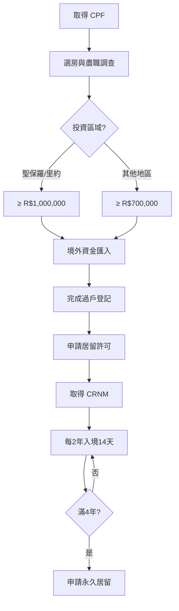
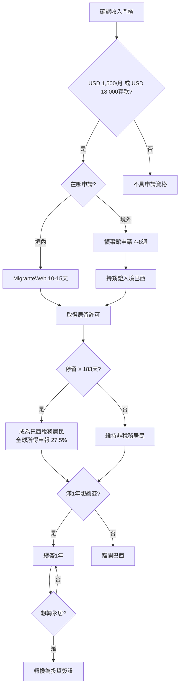

# 簽證戰略全面升級 Implementation Plan

> **For agentic workers:** REQUIRED: Use superpowers:subagent-driven-development (if subagents available) or superpowers:executing-plans to implement this plan. Steps use checkbox (`- [ ]`) syntax for tracking.

**Goal:** 將 VISTO 研究文檔中的簽證戰略、SCE-IED 新制、入境前工作流、決策地圖等內容整合到實戰手冊中，維持統一格式與學習互動體驗。

**Architecture:** 採用方案 B — 新增獨立簽證模塊（01-2, 01-3, 02-1），重寫 02 為決策總覽，更新 05 升級 SCE-IED (RDE-IED)。每個新章節包含互動組件、決策清單、Mermaid 流程圖。

**Naming Convention:** 所有提及舊系統時統一使用 `SCE-IED (RDE-IED)` 格式，括號保留舊名稱以便讀者對照。

**Tech Stack:** Astro 6.1.2, Markdown, TypeScript, Vitest, Mermaid, CSS (Tailwind 4)

---

## File Structure Map

| 動作 | 檔案路徑 | 職責 |
|------|----------|------|
| **新增** | `src/content/handbook/01-2-visa-golden.md` | 黃金簽證完整指南（房產投資、區域門檻、14天居住規則） |
| **新增** | `src/content/handbook/01-3-visa-digital-nomad.md` | 數位遊民簽證指南（VITEM XIV、183天稅務規則、轉換路徑） |
| **重寫** | `src/content/handbook/02-visa-strategy.md` | 簽證總覽 + 5種簽證比較 + 互動決策地圖組件 |
| **新增** | `src/content/handbook/02-1-pre-entry-checklist.md` | 入境前完整清單（CPF、認證、翻譯、e-CPF、POA、Gantt） |
| **更新** | `src/content/handbook/05-bacen-capital.md` | SCE-IED (RDE-IED) 升級 + 定期申報門檻 |
| **更新** | `src/data/glossary.ts` | 新增 SCE-IED、CDNR、CELPE-Bras、MigranteWeb 等新術語 |
| **新增** | `tests/visa-handbook.test.ts` | 驗證新章節結構、CSS class、互動組件標記 |
| **更新** | `src/pages/handbook/[...slug].astro` | 新增決策地圖 JS 邏輯 |

---

## Chunk 1: 黃金簽證章 (01-2-visa-golden.md)

### Task 1: 創建黃金簽證章節

**Files:**
- Create: `src/content/handbook/01-2-visa-golden.md`
- Test: `tests/visa-handbook.test.ts`

- [ ] **Step 1: 創建 01-2-visa-golden.md**

內容大綱：
```markdown
---
title: "黃金簽證：房產投資居留指南"
description: "透過在巴西購買房產取得臨時居留權——區域門檻、資金來源要求、14天居住規則、4年轉永居完整路徑。"
phase: "preparation"
phaseLabel: "第一階段：戰略藍圖"
order: 3
icon: "🏠"
tags: ["黃金簽證", "房產投資", "Visto Gold", "CRNM", "永居", "Matrícula"]
featured: true
---

> **因果連接**：如果你不想經營公司，但需要合法居留巴西——黃金簽證是最低維護成本的路徑。只需持有合規房產，每兩年只需入境 14 天即可維持身份。

## 一、什麼是黃金簽證？

巴西政府允許外國投資者透過購買房產取得**臨時居留許可（Autorização de Residência Temporária por Investimento）**，依據 **CNIg 決議第 45/2020 號**規範。

與投資簽證不同，黃金簽證**不需要你在巴西設立公司或僱用員工**——你只需要擁有一處符合門檻的房產。

## 二、區域投資門檻

| 地區 | 最低投資額 | 涵蓋州份 |
|------|-----------|----------|
| **一線城市** | R$ 1,000,000 | 聖保羅州 (SP)、里約熱內盧州 (RJ) |
| **其他地區** | R$ 700,000 | 東北部、北部、中西部等 |

> **💡 策略建議**：同樣 R$100 萬，在東北部可以買到海景別墅，在聖保羅可能只夠一間小公寓。如果你的目標只是取得居留權，**優先考慮 R$700,000 的區域**。

## 三、嚴格規則清單

### 必須滿足的條件

1. **城市區域 ONLY**：農村土地（área rural）不符合資格
2. **資金必須來自境外**：透過 CDE 帳戶匯入，不可使用巴西境內資金
3. **資金來源透明**：不可使用現金或第三方代付
4. **產權清晰**：Matrícula（房產登記）必須顯示投資人為唯一所有權人
5. **住宅用途**：商業地產需額外審查

### 資金來源要求

- 必須透過正式銀行管道（SWIFT 匯款）
- 匯款備註需註明「Investimento Imobiliário」
- 保留完整資金來源證明（銀行對帳單、薪資證明、資產證明）

## 四、居住要求：每兩年只需 14 天

這是黃金簽證最大的優勢：

- 初始簽證有效期：**4 年（臨時居留）**
- 4 年后可申請**永久居留權（Residência Permanente）**
- 每 2 年內只需在巴西累計居住 **14 天**
- 不要求在巴西工作或經營公司
- 可自由出入境

> **⚠️ 注意**：730 天連續出境 = 自動註銷居留權。如果你完全不去巴西，身份會失效。

## 五、申請流程

### 步驟 1：取得 CPF（入境前）
- 透過巴西領事館或線上申請
- 處理時間：1~2 週

### 步驟 2：選房與盡職調查
- 確認房產為城市區域（zona urbana）
- 檢查 Matrícula 無抵押、無糾紛
- 確認 IPTU（房產稅）已繳清

### 步驟 3：購房與資金匯入
- 簽署買賣合約（Compromisso de Compra e Venda）
- 從境外匯入資金至 CDE 帳戶
- 完成過戶登記（Registro na Matrícula）

### 步驟 4：申請居留許可
- 向聯邦警察局（Polícia Federal）提交申請
- 提交文件：護照、CPF、Matrícula、資金證明、無犯罪記錄
- 繳費：GRU R$ 372.90

### 步驟 5：取得 CRNM
- 錄入生物識別信息
- 2~4 週後收到 CRNM 卡片

## 六、[Mermaid 流程圖] 黃金簽證路徑



## 七、黃金簽證 vs 投資簽證

| 比較維度 | 黃金簽證 | 投資簽證 (RN 36) |
|----------|----------|------------------|
| 最低投資 | R$700,000~1,000,000 | R$500,000 |
| 需要經營公司？ | 不需要 | 需要 |
| 需要僱用員工？ | 不需要 | 不需要 |
| 居住要求 | 每2年14天 | 需實際居住 |
| 永居路徑 | 4年後可申請永久居留 | 4年後可申請永久居留 |
| 維護成本 | 低（僅房產稅） | 中（公司運營成本） |
| 適合對象 | 被動投資者 | 活躍經營者 |

## 八、[關鍵決策] 黃金簽證檢查清單

- [ ] 我是否了解區域投資門檻差異？（SP/RJ = R$100萬 vs 其他 = R$70萬）
- [ ] 我的資金是否可從境外合法匯入？
- [ ] 我是否確認房產為城市區域（非農村）？
- [ ] 我是否了解每2年需入境14天的居住要求？
- [ ] 我是否已準備好無犯罪記錄證明（90天有效期）？
- [ ] 我是否了解 730 天連續出境會導致身份註銷？

完成確認後，你的黃金簽證路徑已清晰——下一步是了解數位遊民簽證，或直接進入入境前準備清單！
```

- [ ] **Step 2: 創建測試檔案 tests/visa-handbook.test.ts**

```typescript
import { describe, it, expect } from 'vitest';
import { readFileSync } from 'fs';
import { join } from 'path';

const srcDir = join(process.cwd(), 'src');

describe('簽證戰略升級 — 黃金簽證章節', () => {
  it('01-2-visa-golden.md 應存在且包含正確 frontmatter', () => {
    const mdPath = join(srcDir, 'content', 'handbook', '01-2-visa-golden.md');
    const md = readFileSync(mdPath, 'utf-8');
    expect(md).toContain('title:');
    expect(md).toContain('phase: "preparation"');
    expect(md).toContain('order: 3');
    expect(md).toContain('icon: "🏠"');
  });

  it('應包含區域投資門檻表格', () => {
    const mdPath = join(srcDir, 'content', 'handbook', '01-2-visa-golden.md');
    const md = readFileSync(mdPath, 'utf-8');
    expect(md).toContain('R$ 1,000,000');
    expect(md).toContain('R$ 700,000');
  });

  it('應包含 14 天居住規則說明', () => {
    const mdPath = join(srcDir, 'content', 'handbook', '01-2-visa-golden.md');
    const md = readFileSync(mdPath, 'utf-8');
    expect(md).toContain('14 天');
    expect(md).toContain('730');
  });

  it('應包含 Mermaid 流程圖', () => {
    const mdPath = join(srcDir, 'content', 'handbook', '01-2-visa-golden.md');
    const md = readFileSync(mdPath, 'utf-8');
    expect(md).toContain('```mermaid');
    expect(md).toContain('graph TD');
  });

  it('應包含決策檢查清單', () => {
    const mdPath = join(srcDir, 'content', 'handbook', '01-2-visa-golden.md');
    const md = readFileSync(mdPath, 'utf-8');
    expect(md).toContain('- [ ]');
  });
});
```

- [ ] **Step 3: 運行測試確認失敗**

```bash
npm test -- tests/visa-handbook.test.ts
```
Expected: FAIL — 檔案不存在

- [ ] **Step 4: 確認檔案創建後測試通過**

```bash
npm test -- tests/visa-handbook.test.ts
```
Expected: PASS

---

## Chunk 2: 數位遊民簽證章 (01-3-visa-digital-nomad.md)

### Task 2: 創建數位遊民簽證章節

**Files:**
- Create: `src/content/handbook/01-3-visa-digital-nomad.md`

- [ ] **Step 1: 創建 01-3-visa-digital-nomad.md**

內容大綱：
```markdown
---
title: "數位遊民簽證：遠程工作者的巴西通行證"
description: "VITEM XIV 數位遊民簽證完整指南——收入門檻、183天稅務居民規則、境內轉換流程、轉投資簽證路徑。"
phase: "preparation"
phaseLabel: "第一階段：戰略藍圖"
order: 4
icon: "💻"
tags: ["數位遊民", "VITEM XIV", "稅務居民", "183天", "遠程工作", "MigranteWeb"]
featured: true
---

> **因果連接**：如果你已在遠程工作，數位遊民簽證是成本最低的「試水溫」方式——先合法入境體驗巴西，再決定是否長期投資。但 183 天規則可能讓你意外成為巴西稅務居民。

## 一、什麼是數位遊民簽證？

**VITEM XIV** 是巴西於 2022 年推出的數位遊民簽證，依據 **CNIg 決議第 45/2021 號**規範。允許外國遠程工作者在巴西合法居住和工作，前提是**你的收入來自境外**。

## 二、申請條件

### 收入門檻（二選一）

| 條件 | 要求 | 說明 |
|------|------|------|
| **月收入** | ≥ USD 1,500 | 需提供雇主合約或客戶合約證明 |
| **銀行存款** | ≥ USD 18,000 | 需提供銀行對帳單（最近 3 個月） |

### 其他要求

- 工作必須完全遠程，不可為巴西實體工作
- 收入必須以**外幣**計價和支付
- 不可與巴西公司簽訂 CLT 勞動合約
- 不可在巴西境內賺取 BRL 收入

## 三、兩種申請途徑

### 途徑 A：境外領事館申請
- 向巴西領事館提交申請
- 處理時間：**4~8 週**
- 適合：首次入境巴西

### 途徑 B：境內轉換（MigranteWeb）
- 已持旅遊簽證入境巴西
- 透過 **MigranteWeb** 系統線上申請
- 處理時間：**10~15 天**
- 適合：已在巴西想延長停留

> **💡 實戰建議**：如果你已經在巴西，**境內轉換是最快的方式**。只需在 MigranteWeb 上傳文件，10 天即可拿到居留許可。

## 四、183 天稅務居民規則——最大陷阱

這是數位遊民簽證最容易被忽略的風險：

| 停留天數 | 稅務身份 | 影響 |
|----------|----------|------|
| < 183 天/12個月 | 非稅務居民 | 僅巴西境內所得需繳稅 |
| ≥ 183 天/12個月 | **巴西稅務居民** | **全球所得**需向巴西申報，最高 27.5% |

> **⚠️ 警告**：一旦成為巴西稅務居民，你在台灣的薪資、美國的投資收益、中國的房租收入——**全部需要向巴西申報**。巴西與多數國家（包括台灣、中國）**沒有雙重徵稅協定**。

### 違規罰款

- 為巴西實體工作：罰款 **R$ 10,000**
- 隱瞞稅務居民身份：可能面臨稅務稽查

## 五、[Mermaid 流程圖] 數位遊民簽證路徑



## 六、數位遊民 → 投資簽證轉換路徑

如果你透過數位遊民簽證體驗後決定長期留在巴西：

1. **設立巴西公司**（CNPJ）
2. **注入投資資金**（R$150,000 科技創業 / R$500,000 一般投資）
3. **完成 SCE-IED 登記**
4. **申請投資簽證**
5. **4 年後申請永久居留**

## 七、數位遊民簽證 vs 黃金簽證

| 比較維度 | 數位遊民簽證 | 黃金簽證 |
|----------|-------------|----------|
| 最低門檻 | USD 1,500/月 | R$700,000~1,000,000 |
| 需要投資？ | 不需要 | 需要購房 |
| 有效期 | 1 年（可續簽） | 4 年 |
| 可為巴西工作？ | 不可 | 不可 |
| 稅務居民風險 | 183 天觸發 | 183 天觸發 |
| 永居路徑 | 需轉換簽證 | 4 年後直接申請 |
| 適合對象 | 遠程工作者 | 被動投資者 |

## 八、[關鍵決策] 數位遊民簽證檢查清單

- [ ] 我的月收入是否 ≥ USD 1,500 或存款 ≥ USD 18,000？
- [ ] 我的工作是否可以完全遠程且不依賴巴西客戶？
- [ ] 我是否了解 183 天稅務居民規則對全球資產的影響？
- [ ] 我是否已準備好最近 3 個月的銀行對帳單或雇主合約？
- [ ] 我是否了解違規為巴西實體工作的罰款為 R$ 10,000？
- [ ] 我是否考慮過從數位遊民轉換為投資簽證的長期路徑？

完成確認後，你的數位遊民路徑已清晰——下一步是了解所有簽證類型的完整決策地圖！
```

- [ ] **Step 2: 在 tests/visa-handbook.test.ts 新增測試**

```typescript
describe('簽證戰略升級 — 數位遊民簽證章節', () => {
  it('01-3-visa-digital-nomad.md 應存在且包含正確 frontmatter', () => {
    const mdPath = join(srcDir, 'content', 'handbook', '01-3-visa-digital-nomad.md');
    const md = readFileSync(mdPath, 'utf-8');
    expect(md).toContain('title:');
    expect(md).toContain('phase: "preparation"');
    expect(md).toContain('order: 4');
    expect(md).toContain('icon: "💻"');
  });

  it('應包含收入門檻', () => {
    const mdPath = join(srcDir, 'content', 'handbook', '01-3-visa-digital-nomad.md');
    const md = readFileSync(mdPath, 'utf-8');
    expect(md).toContain('USD 1,500');
    expect(md).toContain('USD 18,000');
  });

  it('應包含 183 天稅務居民規則', () => {
    const mdPath = join(srcDir, 'content', 'handbook', '01-3-visa-digital-nomad.md');
    const md = readFileSync(mdPath, 'utf-8');
    expect(md).toContain('183');
    expect(md).toContain('27.5%');
  });

  it('應包含 Mermaid 流程圖', () => {
    const mdPath = join(srcDir, 'content', 'handbook', '01-3-visa-digital-nomad.md');
    const md = readFileSync(mdPath, 'utf-8');
    expect(md).toContain('```mermaid');
  });

  it('應包含 MigranteWeb 系統提及', () => {
    const mdPath = join(srcDir, 'content', 'handbook', '01-3-visa-digital-nomad.md');
    const md = readFileSync(mdPath, 'utf-8');
    expect(md).toContain('MigranteWeb');
  });
});
```

---

## Chunk 3: 重寫簽證總覽章 (02-visa-strategy.md)

### Task 3: 重寫 02-visa-strategy.md 為決策總覽 + 互動決策地圖

**Files:**
- Modify: `src/content/handbook/02-visa-strategy.md`
- Modify: `src/pages/handbook/[...slug].astro` (新增 initVisaDecisionMap)
- Modify: `src/styles/global.css` (新增決策地圖樣式)

- [ ] **Step 1: 重寫 02-visa-strategy.md**

核心變更：
- 保留「因果連接」開頭風格
- 擴展為 **5 種簽證完整覆蓋**（投資簽證 RN 36、法定董事 RN 11、黃金簽證、數位遊民 VITEM XIV、高管簽證）
- 加入 2026 最新數據（最低薪資 R$1,621、10% 股息預扣稅）
- 加入 **互動決策地圖組件** `<div class="decision-map" id="visa-decision-map">`
- 加入 **Mermaid 決策樹** 作為靜態總覽
- 保留「在地管理員」風險段落
- 保留 CPF 段落
- 更新決策清單

- [ ] **Step 2: 在 [...slug].astro 新增 initVisaDecisionMap()**

```typescript
// ── Visa Decision Map ────────────────────────────────────
(function initVisaDecisionMap() {
  const container = document.getElementById('visa-decision-map');
  if (!container) return;

  const questions = [
    {
      id: 'identity',
      text: '你的身份是？',
      options: [
        { label: '自然人投資者', next: 'presence', result: null },
        { label: '法人母公司外派', next: 'dispatch', result: null },
      ],
    },
    {
      id: 'presence',
      text: '你是否計畫親赴巴西？',
      options: [
        { label: '是，長期居住', next: 'investment', result: null },
        { label: '是，短期居住', next: 'purpose', result: null },
        { label: '否，完全境外', next: null, result: 'remote' },
      ],
    },
    // ... more questions
  ];

  const results: Record<string, { title: string; desc: string; badge: string }> = {
    'rn11-director': {
      title: '法定董事簽證 (RN 11/2017)',
      desc: '投資 R$600,000 或 R$150,000 + 創造就業 10 個，即刻取得永久居留權。',
      badge: '⭐ 推薦',
    },
    // ... more results
  };

  let currentStep = 0;
  const answers: Record<string, string> = {};

  function renderQuestion() {
    // render logic
  }

  function showResult(resultKey: string) {
    // show recommendation
  }

  renderQuestion();
})();
```

- [ ] **Step 3: 在 global.css 新增決策地圖樣式**

```css
/* ── Visa Decision Map ─────────────────────────────────── */
.decision-map {
  background: linear-gradient(135deg, var(--color-bg-800), #12121f);
  border: 1px solid rgba(var(--color-gold-rgb), 0.2);
  border-radius: var(--radius-card);
  padding: var(--space-4);
  margin: var(--space-4) 0;
}

.decision-map-question {
  font-size: 1.1rem;
  font-weight: 700;
  color: var(--color-gold);
  margin-bottom: var(--space-3);
}

.decision-map-options {
  display: flex;
  flex-direction: column;
  gap: var(--space-2);
}

.decision-map-option {
  background: rgba(var(--color-gold-rgb), 0.08);
  border: 1px solid rgba(var(--color-gold-rgb), 0.2);
  border-radius: 0.5rem;
  padding: 0.75rem 1rem;
  color: var(--color-text);
  font-size: 0.95rem;
  cursor: pointer;
  transition: var(--transition);
}

.decision-map-option:hover {
  border-color: var(--color-gold);
  background: rgba(var(--color-gold-rgb), 0.15);
}

.decision-map-result {
  text-align: center;
  padding: var(--space-3);
}

.decision-map-result-badge {
  display: inline-block;
  background: var(--color-gold);
  color: var(--color-bg-900);
  font-size: 0.75rem;
  font-weight: 700;
  padding: 0.2rem 0.8rem;
  border-radius: 1rem;
  margin-bottom: var(--space-2);
}
```

- [ ] **Step 4: 在 tests/visa-handbook.test.ts 新增測試**

```typescript
describe('簽證戰略升級 — 簽證總覽章節', () => {
  it('02-visa-strategy.md 應包含 5 種簽證類型', () => {
    const mdPath = join(srcDir, 'content', 'handbook', '02-visa-strategy.md');
    const md = readFileSync(mdPath, 'utf-8');
    expect(md).toContain('RN 11');
    expect(md).toContain('RN 36');
    expect(md).toContain('黃金簽證');
    expect(md).toContain('數位遊民');
    expect(md).toContain('高管簽證');
  });

  it('應包含互動決策地圖組件標記', () => {
    const mdPath = join(srcDir, 'content', 'handbook', '02-visa-strategy.md');
    const md = readFileSync(mdPath, 'utf-8');
    expect(md).toContain('visa-decision-map');
  });

  it('應包含 2026 最新數據', () => {
    const mdPath = join(srcDir, 'content', 'handbook', '02-visa-strategy.md');
    const md = readFileSync(mdPath, 'utf-8');
    expect(md).toContain('R$ 1,621');
    expect(md).toContain('10%');
  });

  it('global.css 應定義決策地圖樣式', () => {
    const cssPath = join(srcDir, 'styles', 'global.css');
    const css = readFileSync(cssPath, 'utf-8');
    expect(css).toContain('.decision-map');
    expect(css).toContain('.decision-map-option');
  });
});
```

---

## Chunk 4: 入境前準備清單章 (02-1-pre-entry-checklist.md)

### Task 4: 創建入境前準備清單章節

**Files:**
- Create: `src/content/handbook/02-1-pre-entry-checklist.md`

- [ ] **Step 1: 創建 02-1-pre-entry-checklist.md**

內容大綱：
```markdown
---
title: "入境前完整準備清單：從 CPF 到落地的每一步"
description: "海牙認證、誓約翻譯、e-CPF、gov.br、POA 委任書、Gantt 時間軸——入境巴西前必須完成的 7 大步驟。"
phase: "preparation"
phaseLabel: "第一階段：戰略藍圖"
order: 6
icon: "📋"
tags: ["海牙認證", "誓約翻譯", "e-CPF", "gov.br", "POA", "CPF", "MigranteWeb"]
featured: true
---

> **因果連接**：文件認證的順序錯了，整個流程就要重來。海牙認證必須在文件發出國完成，誓約翻譯必須在巴西境內由註冊翻譯師進行——順序顛倒等於白做。

## 一、Gantt 時間軸總覽（4~8 個月）

[Mermaid Gantt chart]

## 二、Step 1：CPF 申請（W1-W2）

## 三、Step 2：海牙認證（W2-W8）

## 四、Step 3：誓約翻譯（W6-W9）

## 五、Step 4：e-CPF / gov.br 數位身份（W8-W12）

## 六、Step 5：委任巴西代表（Procurador）（W8-W12）

## 七、Step 6：SCE-IED 資本登記（W10-W14）

## 八、Step 7：簽證申請與 CRNM（W14-W30）

## 九、[互動組件] 入境前準備時間軸規劃器

## 十、[關鍵決策] 入境前檢查清單
```

- [ ] **Step 2: 在 tests/visa-handbook.test.ts 新增測試**

```typescript
describe('簽證戰略升級 — 入境前準備清單', () => {
  it('02-1-pre-entry-checklist.md 應存在且包含正確 frontmatter', () => {
    const mdPath = join(srcDir, 'content', 'handbook', '02-1-pre-entry-checklist.md');
    const md = readFileSync(mdPath, 'utf-8');
    expect(md).toContain('phase: "preparation"');
    expect(md).toContain('order: 6');
  });

  it('應包含海牙認證說明', () => {
    const mdPath = join(srcDir, 'content', 'handbook', '02-1-pre-entry-checklist.md');
    const md = readFileSync(mdPath, 'utf-8');
    expect(md).toContain('海牙認證');
    expect(md).toContain('Hague');
  });

  it('應包含誓約翻譯說明', () => {
    const mdPath = join(srcDir, 'content', 'handbook', '02-1-pre-entry-checklist.md');
    const md = readFileSync(mdPath, 'utf-8');
    expect(md).toContain('誓約翻譯');
    expect(md).toContain('Tradução Juramentada');
  });

  it('應包含 e-CPF / gov.br 說明', () => {
    const mdPath = join(srcDir, 'content', 'handbook', '02-1-pre-entry-checklist.md');
    const md = readFileSync(mdPath, 'utf-8');
    expect(md).toContain('gov.br');
    expect(md).toContain('e-CPF');
  });

  it('應包含 Gantt 時間軸（Mermaid）', () => {
    const mdPath = join(srcDir, 'content', 'handbook', '02-1-pre-entry-checklist.md');
    const md = readFileSync(mdPath, 'utf-8');
    expect(md).toContain('gantt');
  });
});
```

---

## Chunk 5: 更新 BACEN 資本章 (05-bacen-capital.md)

### Task 5: 升級 RDE-IED → SCE-IED

**Files:**
- Modify: `src/content/handbook/05-bacen-capital.md`

- [ ] **Step 1: 更新 05-bacen-capital.md**

核心變更：
- 標題更新為包含 SCE-IED (RDE-IED)
- 新增「RDE-IED → SCE-IED (RDE-IED) 演進」段落（Lei 14.286/2021、Resolução BCB 278/2022）
- 更新申報流程：從 SISBACEN 改為 SCE-IED (RDE-IED)（gov.br Silver/Gold 登入）
- 新增 CDNR 前置註冊說明
- 新增定期申報門檻表格（季度 R$300M、年度 R$250M、五年 USD 100M）
- 新增資本注入 modalities（貨幣、房產/資產、虛擬資產、債權轉換）
- 新增 2024 年 10 月自由化（取消 30 天更新規則）
- 新增處罰機制（匯兌操作暫停、罰款）
- 保留原有的「一致性」鐵律和資本額精算模型
- 全文所有 RDE-IED 均替換為 SCE-IED (RDE-IED)

- [ ] **Step 2: 在 tests/visa-handbook.test.ts 新增測試**

```typescript
describe('簽證戰略升級 — SCE-IED 資本章節', () => {
  it('05-bacen-capital.md 應提及 SCE-IED', () => {
    const mdPath = join(srcDir, 'content', 'handbook', '05-bacen-capital.md');
    const md = readFileSync(mdPath, 'utf-8');
    expect(md).toContain('SCE-IED');
  });

  it('應提及 Resolução BCB 278/2022', () => {
    const mdPath = join(srcDir, 'content', 'handbook', '05-bacen-capital.md');
    const md = readFileSync(mdPath, 'utf-8');
    expect(md).toContain('278/2022');
  });

  it('應包含定期申報門檻', () => {
    const mdPath = join(srcDir, 'content', 'handbook', '05-bacen-capital.md');
    const md = readFileSync(mdPath, 'utf-8');
    expect(md).toContain('R$ 300M');
    expect(md).toContain('R$ 250M');
  });

  it('應包含 CDNR 說明', () => {
    const mdPath = join(srcDir, 'content', 'handbook', '05-bacen-capital.md');
    const md = readFileSync(mdPath, 'utf-8');
    expect(md).toContain('CDNR');
  });
});
```

---

## Chunk 6: 更新 Glossary 詞典

### Task 6: 新增簽證相關術語到 glossary.ts

**Files:**
- Modify: `src/data/glossary.ts`

- [ ] **Step 1: 在 glossary.ts 新增以下術語條目**

新增條目清單（插入到現有條目之後、`chapterTerms` 之前）：

```typescript
// ═══════════════════════════════════════════
// 簽證與移民類 (Visa & Immigration)
// ═══════════════════════════════════════════
{
  term: 'CRNM',
  category: 'id',
  pronunciation: '塞-赫-恩-恩-梅',
  fullPortuguese: 'Carteira de Registro Nacional Migratório',
  chineseName: '外僑登記證',
  analogy: '🇹🇼 類似台灣的外僑居留證',
  oneLiner: '外國人在巴西的「身分證」，所有簽證持有人必須取得。',
  fullExplanation: 'CRNM 是巴西聯邦警察局發給外國居留者的身份證件。取得簽證批准後 90 天內必須完成 CRNM 登記，繳納 GRU 費用 R$372.90，錄入生物識別信息。卡片 2~4 週後寄達。未如期登記將面臨 R$10,000+ 罰款。',
  practicalTips: [
    '簽證批准後 90 天內必須完成登記',
    '需繳納 GRU 費用 R$372.90',
    '需錄入指紋和照片',
    '地址變更需在 30 天內通知聯邦警察',
  ],
  commonMistakes: [
    '超過 90 天未登記被罰款',
    '搬家後未更新地址',
    '連續 730 天出境導致身份註銷',
  ],
  relatedTerms: ['CPF', 'VITEM', 'Polícia Federal'],
},
{
  term: 'SCE-IED',
  category: 'system',
  pronunciation: '埃-塞-埃-伊-埃-迪',
  fullPortuguese: 'Sistema de Prestação de Informações de Capital Estrangeiro',
  chineseName: '外資資訊申報系統',
  analogy: '🇹🇼 類似台灣的外資投資線上申報平台',
  oneLiner: '巴西央行的外資登記系統，取代舊版 RDE-IED，2022 年起實施。',
  fullExplanation: 'SCE-IED 是巴西中央銀行（BCB）於 2022 年推出的外資資訊申報系統，取代舊版 RDE-IED。依據 Lei 14.286/2021 和 Resolução BCB 278/2022 建立。從「事前審批」改為「申報制透明度」，透過 gov.br 帳號（Silver/Gold 級別）或 Sisbacen 操作。≥ USD 100,000 的匯款需要在匯兌合約中綁定 SCE-IED 代碼。',
  practicalTips: [
    '透過 gov.br Silver/Gold 級別帳號登入',
    '≥ USD 100,000 需要 SCE-IED 代碼',
    '資本注入時才需登記，非匯款前',
    'CDNR（非居民登記）必須在資金流動前完成',
    '文件需保留 5 年',
  ],
  commonMistakes: [
    '以為和舊版 RDE-IED 一樣需要事前審批',
    '忽略 CDNR 前置註冊',
    '未按期提交定期申報',
  ],
  relatedTerms: ['BACEN', 'CDNR', 'RDE-IED', 'CNPJ'],
},
{
  term: 'CELPE-Bras',
  category: 'id',
  pronunciation: '塞-歐-佩-布哈-斯',
  fullPortuguese: 'Certificado de Proficiência em Língua Portuguesa para Estrangeiros',
  chineseName: '葡語能力認證',
  analogy: '🇹🇼 類似托福的葡語考試',
  oneLiner: '申請巴西歸化（國籍）必須通過的葡語能力考試。',
  fullExplanation: 'CELPE-Bras 是巴西教育部認可的葡語能力認證考試，專門針對外國人設計。申請巴西歸化（naturalização）時必須提供此證書。考試分為初級、中級、高級三個等級，歸化通常需要中級以上。每年舉辦兩次。',
  practicalTips: [
    '每年舉辦兩次，提前 3 個月報名',
    '歸化需要中級（Intermediário）以上',
    '考試地點：巴西境內的認證中心',
  ],
  commonMistakes: [
    '以為持有簽證就不需要考葡語',
    '混淆 CELPE-Bras 與其他葡語考試',
  ],
  relatedTerms: ['CRNM', 'Naturalização'],
},
{
  term: 'MigranteWeb',
  category: 'system',
  pronunciation: '米-格蘭-奇-韋布',
  fullPortuguese: 'MigranteWeb',
  chineseName: '移民線上系統',
  analogy: '🇹🇼 類似台灣的移民署線上申辦系統',
  oneLiner: '巴西司法部的移民線上申請平台，可辦理簽證轉換、CRNM 登記等。',
  fullExplanation: 'MigranteWeb 是巴西司法部（MJSP）管理的移民線上申請系統。外國人可透過此系統申請簽證類型轉換、居留許可延長、CRNM 登記等。境內轉換數位遊民簽證只需 10-15 天即可获批。需搭配 gov.br 帳號使用。',
  practicalTips: [
    '需要 gov.br Silver/Gold 帳號',
    '境內轉換簽證處理時間 10-15 天',
    '可上傳文件、追蹤申請進度',
  ],
  commonMistakes: [
    '用錯系統（應使用 MigranteWeb 而非 Sisbacen）',
    '文件上傳不完整導致延誤',
  ],
  relatedTerms: ['gov.br', 'CRNM', 'VITEM'],
},
{
  term: 'CDNR',
  category: 'system',
  pronunciation: '塞-迪-恩-恩-赫-埃',
  fullPortuguese: 'Cadastro Declaratório de Não Residente',
  chineseName: '非居民登記',
  analogy: '🇹🇼 類似非居民身份預登記',
  oneLiner: 'SCE-IED 系統中的非居民登記，必須在任何資金流動前完成。',
  fullExplanation: 'CDNR 是 SCE-IED 系統中的非居民登記模組。境外投資者在進行任何資金流動（資本注入、利潤匯回）之前，必須先完成 CDNR 登記。這是 SCE-IED 系統的前置步驟，確保央行能追蹤非居民的资金活動。',
  practicalTips: [
    '必須在資金流動前完成',
    '透過 SCE-IED 系統操作',
    '需要境外投資者的完整資訊',
  ],
  commonMistakes: [
    '直接進行資本注入而忽略 CDNR',
    '以為 CDNR 和 SCE-IED 登記是同一件事',
  ],
  relatedTerms: ['SCE-IED', 'BACEN'],
},
{
  term: 'CNIg',
  category: 'agency',
  pronunciation: '塞-尼-伊-熱',
  fullPortuguese: 'Conselho Nacional de Imigração',
  chineseName: '國家移民理事會',
  analogy: '🇹🇼 類似台灣的移民政策決策委員會',
  oneLiner: '巴西制定移民政策的最高機構，所有簽證決議（RN）均由此發布。',
  fullExplanation: 'CNIg 是巴西國家移民理事會，隸屬於勞工部。負責制定和發布所有移民相關的規範決議（Resolução Normativa, RN）。例如 RN 11/2017（法定董事簽證）、RN 36/2018（投資簽證）、RN 45/2021（數位遊民簽證）等均由此機構發布。',
  practicalTips: [
    '所有簽證類型的法律依據都來自 CNIg 決議',
    '可查詢最新決議以了解政策變化',
  ],
  commonMistakes: [
    '混淆 CNIg 和聯邦警察局（前者制定政策，後者執行）',
  ],
  relatedTerms: ['RN 11', 'RN 36', 'Polícia Federal'],
},
{
  term: 'Procurador',
  category: 'legal',
  pronunciation: '普霍-庫哈-多赫',
  fullPortuguese: 'Procurador / Representante Legal',
  chineseName: '委任代表/法定代理人',
  analogy: '🇹🇼 類似台灣的授權代理人',
  oneLiner: '在巴西境外時，代表你處理法律事務的巴西境內授權人士。',
  fullExplanation: 'Procurador 是透過公證委任書（Procuração）授權的巴西境內代表。可代為處理 CPF 申請、公司設立、銀行開戶、稅務申報等事務。委任書需明確授權範圍，建議設定權限限制以控制風險。',
  practicalTips: [
    '委任書需經過海牙認證和誓約翻譯',
    '建議設定明確的權限範圍',
    '可隨時撤銷委任',
  ],
  commonMistakes: [
    '授予過多權限（Pleno Poder 全權授權風險極高）',
    '未定期審查代表人的行為',
  ],
  relatedTerms: ['Pleno Poder', 'Procuração', 'CPF'],
},
```

- [ ] **Step 2: 更新 chapterTerms 映射**

```typescript
'01-2-visa-golden': ['CRNM', 'CPF', 'Matrícula', 'CNIg'],
'01-3-visa-digital-nomad': ['MigranteWeb', 'CRNM', 'CPF', 'IRPF'],
'02-visa-strategy': ['CPF', 'CRNM', 'CNIg', 'SCE-IED', 'Procurador', 'Pleno Poder', 'MigranteWeb', 'CELPE-Bras'],
'02-1-pre-entry-checklist': ['CPF', 'e-CPF', 'gov.br', 'Procurador', 'SCE-IED', 'CDNR', 'MigranteWeb', 'CRNM'],
'05-bacen-capital': ['BACEN', 'SCE-IED', 'CDNR', 'CNPJ', 'RADAR', 'SISBACEN', 'Capital Social', 'IOF'],
```

- [ ] **Step 3: 在 tests/visa-handbook.test.ts 新增測試**

```typescript
describe('簽證戰略升級 — Glossary 詞典', () => {
  it('應包含 SCE-IED 術語', () => {
    const tsPath = join(srcDir, 'data', 'glossary.ts');
    const ts = readFileSync(tsPath, 'utf-8');
    expect(ts).toContain("'SCE-IED'");
  });

  it('應包含 CDNR 術語', () => {
    const tsPath = join(srcDir, 'data', 'glossary.ts');
    const ts = readFileSync(tsPath, 'utf-8');
    expect(ts).toContain("'CDNR'");
  });

  it('應包含 CELPE-Bras 術語', () => {
    const tsPath = join(srcDir, 'data', 'glossary.ts');
    const ts = readFileSync(tsPath, 'utf-8');
    expect(ts).toContain("'CELPE-Bras'");
  });

  it('應包含 MigranteWeb 術語', () => {
    const tsPath = join(srcDir, 'data', 'glossary.ts');
    const ts = readFileSync(tsPath, 'utf-8');
    expect(ts).toContain("'MigranteWeb'");
  });
});
```

---

## Chunk 7: 最終驗證

### Task 7: 完整測試與構建驗證

- [ ] **Step 1: 運行完整測試套件**

```bash
npm test
```
Expected: ALL PASS (原有 169 + 新增簽證測試)

- [ ] **Step 2: 運行構建**

```bash
npm run build
```
Expected: 18+ pages built successfully (新增 4 個 handbook 頁面)

- [ ] **Step 3: 驗證所有新章節在時間軸上正確排序**

確認 order 值：
- 01-tax-system: order 1
- 01-1-tax-timeline: order 2
- 01-2-visa-golden: order 3
- 01-3-visa-digital-nomad: order 4
- 02-visa-strategy: order 5
- 02-1-pre-entry-checklist: order 6
- 03-local-team: order 7 (原 order 3)
- 04-company-setup: order 8 (原 order 4)
- 05-bacen-capital: order 9 (原 order 5)
- ...後續章節 order 依次 +4

---

## Order 重新編排總表

| 檔案 | 原 order | 新 order | 階段 |
|------|----------|----------|------|
| 01-tax-system | 1 | 1 | preparation |
| 01-1-tax-timeline | 2 | 2 | preparation |
| **01-2-visa-golden** | — | **3** | preparation |
| **01-3-visa-digital-nomad** | — | **4** | preparation |
| 02-visa-strategy | 3 | **5** | preparation |
| **02-1-pre-entry-checklist** | — | **6** | preparation |
| 03-local-team | 4 | **7** | preparation |
| 04-company-setup | 5 | **8** | foundation |
| 05-bacen-capital | 6 | **9** | foundation |
| 06-ecommerce-platforms | 7 | **10** | operations |
| 07-radar-import | 8 | **11** | operations |
| 08-3pl-warehouse | 9 | **12** | operations |
| 08-1-3pl-contract | 10 | **13** | operations |
| 09-erp-payment | 11 | **14** | operations |
| 09-1-split-payment | 12 | **15** | operations |
| 10-after-sales-service | 13 | **16** | harvest |
| 11-tax-compliance | 14 | **17** | harvest |
| 12-profit-remittance | 15 | **18** | harvest |
