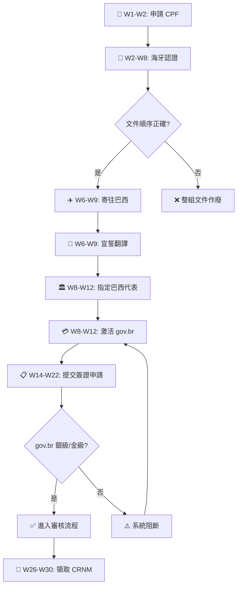

> **因果連接**：如果你不先辦好 CPF 和海牙認證就飛到巴西——你將面臨「人在巴西、文件還在原籍國認證中」的尷尬局面，簽證申請直接延後 2~4 個月。巴西官僚體系不接受「到了再說」——文件不全 = 簽證被退 = 數月 wasted。

## 一、為什麼入境前準備決定成敗？

巴西的移民程序極度依賴**數位化合規**與**精確的文書處理**。2026 年的新稅制與行政升級更是增加了複雜度。所有外國文件必須經過兩道關鍵關卡才能進入巴西法律體系：

1. **原籍國海牙認證（Apostila da Haia）**：證明文件真實性
2. **巴西境內宣誓翻譯（Tradução Juramentada）**：巴西不承認任何外國翻譯公司的譯本

> **⚠️ 順序鐵律**：原件 → 海牙認證 → 寄往巴西 → 宣誓翻譯。**順序顛倒 = 整組文件作廢**。

---

## 二、第一優先：CPF 線上申請（W1-W2）

**CPF（Cadastro de Pessoas Físicas）** 是你在巴西進行任何法律行為的基礎——沒有它，你無法租房、買房、開戶、甚至無法啟動大部分簽證申請流程。

### 誰需要 CPF？

**所有人**。無論你選擇哪種簽證路徑，CPF 是啟動一切的法律鑰匙。

### 線上申請步驟

| 步驟 | 行動 | 說明 |
|------|------|------|
| 1 | 訪問聯邦稅局官網 | Receita Federal do Brasil 的 CPF 申請頁面 |
| 2 | 選擇非居民（Non-resident）選項 | 填寫個人基本資訊 |
| 3 | 上傳護照掃描件 + 手持護照自拍照 | 用於身份驗證 |
| 4 | 等待核發 | 通常 **1~2 週** 完成 |
| 5 | 取得數位 CPF 號碼 | 無需實體卡片，號碼即可使用 |

### 所需文件清單

| 文件 | 說明 | 備註 |
|------|------|------|
| **有效護照（Passaporte）** | 個人資料頁掃描件 | 有效期不少於 18 個月 |
| **Ficha Cadastral de Pessoa Física** | 聯邦稅局門戶填寫後生成的 PDF | 線上填寫 |
| **身份驗證照片** | 手持護照個人資料頁的自拍照 | 需清晰顯示臉部與證件 |
| **出生證明（Certidão de Nascimento）** | 若護照未標註父母姓名則必須提供 | 需海牙認證 |
| **海外居住證明（Comprovante de Residência）** | 原籍國地址證明 | 水電費單或銀行對帳單 |

> **💡 實戰建議**：不要等到入境再辦 CPF。現在就可以透過聯邦稅局官網或巴西領事館申請。核發後取得的是數位號碼，無需實體卡片即可在巴西法律體系中使用。

---

## 三、文件雙重認證：海牙認證 + 宣誓翻譯（W2-W9）

### 海牙認證（Apostila da Haia）

此步驟必須在文件的**簽發國**完成，用以證明文件原件的真實性。

| 項目 | 說明 |
|------|------|
| **時程** | 視簽發國行政效率而定，通常建議預留 **2~4 週** |
| **成本** | 整套申請文件的認證費用估計在 **USD 300~800** 之間 |
| **辦理地點** | 文件簽發國的指定機構（如台灣的外交部領事事務局） |

### 宣誓翻譯（Tradução Juramentada）

文件寄抵巴西後，必須由各州商業登記處（Junta Comercial）註冊的宣誓翻譯員翻譯。

**計費標準**：以「標準頁」（Lauda，約 1,000 字）為單位計費。

| 文件類型 | 費用（BRL） | 時程 |
|----------|------------|------|
| 護照與簽證 | R$90~110 | 1 個工作日 |
| 出生或結婚證明 | R$100~130 | 1~2 個工作日 |
| 大學學位證書 | R$130~160 | 2~3 個工作日 |
| 成績單或法院判決 | R$140~180 | 3~5 個工作日 |
| **整套預算** | **R$500~2,000** | |

> **⚠️ 關鍵合規提醒**：
> - 聯邦警察通常要求宣誓翻譯件的有效期在 **6 個月內**
> - 若翻譯員使用 ICP-Brasil 數位簽章，聯邦警察通常接受 PDF 版本
> - 巴西**不承認**任何外國翻譯公司的譯本，無論其是否經過公證

---

## 四、海牙認證文件清單

### 個人文件（Documentos Pessoais）

| 文件 | 說明 | 有效期 |
|------|------|--------|
| **有效護照（Passaporte）** | 有效期需不少於 18 個月 | 依護照有效期 |
| **無犯罪紀錄證明（Certidão de Antecedentes Criminais）** | 過去 5 年內居住超過 6 個月的所有國家 | **90 天**（聯邦警察審核極嚴） |
| **學位證書或資歷證明（Diploma / Certificado de Conclusão）** | 專業背景必須與在巴西擔任的職位具有相關性 | 永久 |
| **出生或結婚證明（Certidão de Nascimento / Casamento）** | 用於核對父母姓名或辦理家屬隨行 | 永久 |

### 公司文件（Documentos Corporativos）

| 文件 | 說明 |
|------|------|
| **公司章程（Contrato Social / Estatuto Social）** | 須顯示該外國公司為巴西實體的出資方 |
| **任命決議（Ata de Nomeação / Deliberação）** | 正式指派該外籍人士擔任法定負責人職務的會議紀錄 |
| **委託書（Procuração）** | 授權一名巴西境內常駐居民作為該外國股東的法律代表 |
| **資金來源證明（Comprovante de Origem de Fundos）** | 如銀行流水或稅務申報，證明匯入巴西的資本來源合法 |

---

## 五、指定巴西常駐代表（Procurador）

外國投資者或股東必須委任一名居住在巴西的人員作為其法律聯繫人，負責接收司法通知。

### 委託書（Procuração）五大法定條款

| 條款 | 內容 |
|------|------|
| **當事人身份資料（Qualificação das Partes）** | 授權人（外國公司）完整名稱、總部地址；受託人（巴西居民）CPF、身份證號碼及居住地址 |
| **司法處置與收受傳票權（Poderes para Receber Citação）** | 明確授予受託人代表外國股東收受司法或行政通知、傳票及訴訟文件的權力——這是巴西法律對外國投資者的**強制性要求** |
| **公共機關代表權（Representação perante Órgãos Públicos）** | 授權受託人在聯邦稅務局（Receita Federal）、中央銀行（Banco Central）及商業登記處（Junta Comercial）辦理各項手續 |
| **外商投資系統管理權（Gestão nos Sistemas SCE-IED / SCE-Crédito）** | 明確授權受託人作為 Mandatário（受託代表人），在巴西中央銀行系統中進行外商直接投資的登記與申報 |
| **銀行與財務權限（Poderes Bancários e Financeiros）** | 如需，授予受託人在巴西商業銀行開立帳戶、簽署匯兌合約及匯回利潤的權利 |

> **⚠️ 文書合規**：這份委託書若在外國簽署，必須完成：海牙認證（原籍國）→ 宣誓翻譯（巴西）→ 商業登記處備案。

---

## 六、數位帳號激活：gov.br 門戶

2026 年起，巴西移民系統已全面併入 **gov.br** 單一登錄門戶。

| 項目 | 說明 |
|------|------|
| **安全等級** | 建議達到**銀級或金級**，否則無法進入 SCE-IED 或 MigranteWeb 系統 |
| **關聯系統** | SCE-IED（外資申報）、MigranteWeb（移民申請）、聯邦警察預約 |
| **激活時機** | 建議入境前激活，避免在機場辦理登機或後續預約時面臨系統阻斷 |

---

## 七、簽證特定文件準備

| 文件 | 適用簽證 | 說明 |
|------|---------|------|
| **無犯罪紀錄證明** | 所有簽證 | 需提供過去 5 年內居住超過 6 個月的所有國家的證明，有效期通常僅 **90 天** |
| **健康保險（Seguro Saúde）** | 數位遊民簽證強制 | 必須明確涵蓋巴西境內的住院、門診及緊急轉運，且必須翻譯成葡萄牙語 |
| **商業計畫書（Plano de Negócios）** | 科技投資簽證（R$150,000 優惠門檻） | 需經專業孵化器或加速器背書 |

---

## 八、完整甘特圖：從文件準備到簽證提交

| 階段 | 週次 | 任務節點 | 執行內容 | 關鍵交付物 |
|------|------|---------|---------|-----------|
| **第一階段：稅務啟動** | W1-W2 | 申請 CPF（Cadastro de Pessoas Físicas） | 投資人於網上或領事館辦理 | 個人稅務號碼 |
| **第二階段：文件合法化** | W2-W8 | 海牙認證（Apostila da Haia） | 在原籍國辦理學歷、無犯罪證明及公司文件的真實性認證 | 已認證原件 |
| | W6-W9 | 宣誓翻譯（Tradução Juramentada） | 將認證文件寄往巴西境內，由註冊譯員翻譯成葡語 | 葡語譯本 |
| **第三階段：公司與財務** | W8-W12 | 指定代表與開戶（Procurador & Conta Bancária） | 委任巴西常駐管理人員，並在巴西商業銀行開立公司帳戶 | 委任書、銀行帳號 |
| | W10-W14 | 資本登記與 SCE-IED (RDE-IED) | 將資本匯入，並於 30 天內在央行系統完成登記 | 央行登記證明 |
| **第四階段：簽證審核** | W14-W22 | 移民管理系統（MigranteWeb）提交 | 向巴西司法部（MJSP）提交申請 | 居留授權批准 |
| | W20-W26 | 領事館取簽（Visto Consular） | 批准後，人員前往所在地領事館面談並在護照上貼簽 | 入境簽證 |
| **第五階段：境內註冊** | W26-W30 | CRNM 採集（Registro Nacional Migratório） | 入境 90 天內前往聯邦警察局採集指紋與生物信息 | 臨時身份證明 |
| | W34+ | 領取 CRNM 卡 | 採集後約 2~4 週領取實體或數位卡片 | 巴西身份證 |

> **⚠️ 2026 年核心「坑點」預警**：
> - **數位門戶強制性（gov.br）**：所有人員必須在入境前激活 gov.br 數位身份
> - **兩年離境規則**：連續離開巴西超過 730 天，居留許可將被自動撤銷
> - **183 天稅務紅線**：12 個月內累計居住超過 183 天，即自動成為巴西稅務居民

---

## 九、[關鍵決策] 入境前準備完整檢查清單

- [ ] 我是否已為所有預計入境人員申請 CPF（線上或領事館）？
- [ ] 我是否已收集所有需要海牙認證的文件（護照、無犯罪證明、學位證書、出生/結婚證明）？
- [ ] 我是否了解無犯罪證明的 90 天有效期限制？
- [ ] 我是否已確認海牙認證的正確順序（原件 → 認證 → 寄往巴西 → 宣誓翻譯）？
- [ ] 我是否已預估宣誓翻譯的費用與時程（整套 R$500~2,000，1~5 個工作日）？
- [ ] 我是否已準備好委託書（Procuração）並包含五大法定條款？
- [ ] 我是否已激活 gov.br 數位帳號（銀級或金級）？
- [ ] 我是否已確認健康保險涵蓋巴西全境且包含葡語翻譯（數位遊民強制）？
- [ ] 我是否了解 183 天稅務居民規則對全球資產的影響？
- [ ] 我是否了解 730 天連續出境會導致居留權自動註銷？

完成入境前準備後，你的法律基礎已經建立——下一步是理解巴西稅制並選擇最適合你的簽證路徑！

## 流程圖

