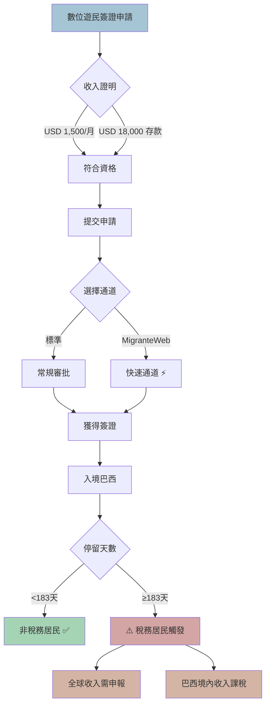

> **因果連接**：如果你已在遠程工作，數位遊民簽證是成本最低的「試水溫」方式——先合法入境體驗巴西，再決定是否長期投資。但 183 天規則可能讓你意外成為巴西稅務居民。

## 一、什麼是數位遊民簽證？

**VITEM XIV** 是巴西於 2022 年推出的數位遊民簽證，依據 **CNIg 決議第 45/2021 號**（RN 45/2021）規範。允許外國遠程工作者在巴西合法居住和工作，前提是**你的收入來自境外**。

> **💡 核心優勢**：無需投資、無需設立公司——只要有穩定的境外收入，即可合法居留巴西。

## 二、申請條件

### 收入門檻（二選一）

| 條件 | 要求 | 說明 |
|------|------|------|
| **月收入** | ≥ USD 1,500 | 需提供雇主合約或客戶合約證明 |
| **銀行存款** | ≥ USD 18,000 | 需提供銀行對帳單（最近 3 個月） |

### 其他要求

- 工作必須完全遠程，**不可為巴西實體工作**
- 收入必須以**外幣**計價和支付
- 不可與巴西公司簽訂 CLT 勞動合約
- 不可在巴西境內賺取 BRL 收入

## 三、兩種申請途徑

### 途徑 A：境外領事館申請
- 向巴西領事館提交申請
- 處理時間：**4~8 週**
- 適合：首次入境巴西

### 途徑 B：境內轉換（MigranteWeb）
- 已持旅遊簽證入境巴西
- 透過 **MigranteWeb** 系統線上申請
- 處理時間：**10~15 天**
- 適合：已在巴西想延長停留

> **💡 實戰建議**：如果你已經在巴西，**境內轉換是最快的方式**。只需在 MigranteWeb 上傳文件，10 天即可拿到居留許可。

## 四、183 天稅務居民規則——最大陷阱

這是數位遊民簽證最容易被忽略的風險：

| 停留天數 | 稅務身份 | 影響 |
|----------|----------|------|
| < 183 天/12個月 | 非稅務居民 | 僅巴西境內所得需繳稅 |
| ≥ 183 天/12個月 | **巴西稅務居民** | **全球所得**需向巴西申報，最高 27.5% |

> **⚠️ 警告**：一旦成為巴西稅務居民，你在巴西境外的薪資、美國的投資收益、中國的房租收入——**全部需要向巴西申報**。巴西與多數國家（包括台灣、中國）**沒有雙重徵稅協定**。

### 2026 年稅改新增影響

- **10% 股息預扣稅**（Lei 15.270/2025）：2026 年 1 月 1 日起，巴西公司分配的股息需繳納 10% 預扣稅
- **IRPFM（最低所得稅）**：年收入超過 R$600,000 的納稅人，實際稅率不得低於 10%

### 違規罰款

- 為巴西實體工作：罰款 **R$ 10,000**
- 隱瞞稅務居民身份：可能面臨稅務稽查

## 五、數位遊民簽證完整路徑圖

💻
<h4 class="decision-flow-title">數位遊民簽證路徑</h4>

從確認收入到永久居留的完整決策流程

1

確認收入門檻

月收入 ≥ USD 1,500 或 存款 ≥ USD 18,000

2

選擇申請途徑

境外領事館（4~8 週）或 境內 MigranteWeb（10~15 天）

3

取得居留許可

持簽證入境或境內轉換，錄入生物識別

4

⚠️ 稅務居民檢查

12 個月內停留 ≥ 183 天 → 成為巴西稅務居民，全球所得申報 27.5%

5

續簽或離開

滿 1 年可續簽 1 年，或離開巴西

6

轉換為投資簽證 → 永久居留

設立公司 + 注入資金 → SCE-IED 登記 → 4 年後申請永久居留

## 六、數位遊民 → 投資簽證轉換路徑

如果你透過數位遊民簽證體驗後決定長期留在巴西：

1. **設立巴西公司**（CNPJ）
2. **注入投資資金**（R$150,000 科技創業 / R$500,000 一般投資）
3. **完成 SCE-IED (RDE-IED) 登記**
4. **申請投資簽證（RN 36）**
5. **4 年後申請永久居留**

> **💡 策略優勢**：數位遊民簽證讓你「先體驗再決定」——在巴西生活 1 年後，如果確定要長期發展，再轉換為投資簽證，避免盲目投資的風險。

## 七、數位遊民簽證 vs 黃金簽證

| 比較維度 | 數位遊民簽證 | 黃金簽證 |
|----------|-------------|----------|
| 最低門檻 | USD 1,500/月 | R$700,000~1,000,000 |
| 需要投資？ | 不需要 | 需要購房 |
| 有效期 | 1 年（可續簽） | 4 年 |
| 可為巴西工作？ | 不可 | 不可 |
| 稅務居民風險 | 183 天觸發 | 183 天觸發 |
| 永居路徑 | 需轉換簽證 | 4 年後直接申請 |
| 適合對象 | 遠程工作者 | 被動投資者 |

## 八、[關鍵決策] 數位遊民簽證檢查清單

- [ ] 我的月收入是否 ≥ USD 1,500 或存款 ≥ USD 18,000？
- [ ] 我的工作是否可以完全遠程且不依賴巴西客戶？
- [ ] 我是否了解 183 天稅務居民規則對全球資產的影響？
- [ ] 我是否已準備好最近 3 個月的銀行對帳單或雇主合約？
- [ ] 我是否了解違規為巴西實體工作的罰款為 R$ 10,000？
- [ ] 我是否考慮過從數位遊民轉換為投資簽證的長期路徑？

完成確認後，你的數位遊民路徑已清晰——下一步是了解所有簽證類型的完整決策地圖！

## 流程圖

