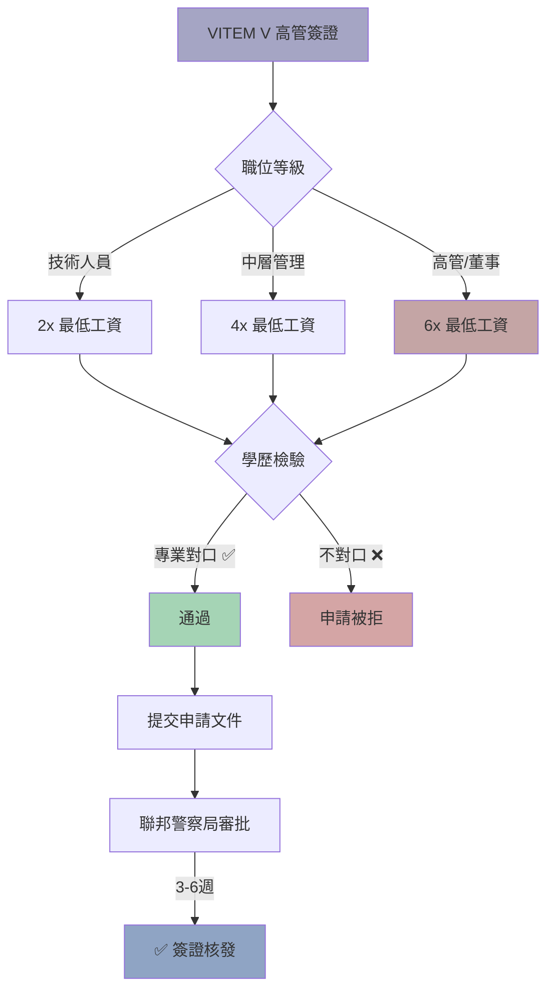

> **因果連接**：如果你的母公司已在巴西設立子公司，VITEM V 是外派人員最快速的路徑——無需投資門檻，審批通常只需 3~6 週。但學歷不對位、薪資不合規，申請會被直接退回。

## 一、什麼是高管簽證？

**VITEM V** 是巴西的技術/高管工作簽證，依據 **CNIg（國家移民委員會）** 相關決議規範。允許巴西公司聘用外籍專業人士或跨國公司外派高管至巴西子公司工作。

與其他簽證路徑不同，VITEM V **不需要個人投資**，而是由巴西雇主（子公司）作為申請主體。

> **💡 核心優勢**：無需投資門檻、審批速度通常最快（3~6 週）、持有滿 4 年后可申請永久居留。

## 二、2026 年最低工資上調的連鎖反應

2026 年 1 月 1 日生效的法定最低工資調整至 **R$1,621**，直接拉高了外籍員工的薪酬成本基準。

### 薪資門檻要求

| 職位類型 | 最低薪資要求 | 說明 |
|----------|-------------|------|
| **技術人員** | ≥ 2 倍最低工資（R$3,242） | 需具備專業學歷或 10 年以上相關經驗 |
| **中層管理** | ≥ 4 倍最低工資（R$6,484） | 需具備管理經驗 |
| **高管/董事** | ≥ 6 倍最低工資（R$9,726） | 需具備高級管理經驗 |

> **⚠️ Local-plus 陷阱**：對於派駐高管的「Local-plus」安排，企業必須確保其**基本工資（Base Salary）**至少符合上述標準。任何海外發放的津貼（Allowances）若未反映在巴西的工資單上，在續簽或審核時將**不被視為符合薪資門檻**。

### 稅務影響

| 稅種 | 說明 |
|------|------|
| **IRPF（個人所得稅）** | 巴西薪資需繳納 IRPF，最高邊際稅率 27.5% |
| **INSS（社會保障金）** | 雇主與員工共同繳納，零容忍「掛名董事」 |
| **FGTS（遣散補償基金）** | 雇主按月繳納員工薪資的 8% |
| **Pró-labore（董事薪酬）** | 法定董事的薪酬，需繳納 INSS |

---

## 三、申請條件與文件要求

### 基本條件

| 條件 | 說明 |
|------|------|
| **巴西雇主** | 必須有巴西公司（CNPJ）作為申請主體 |
| **薪資門檻** | 符合上述最低薪資倍數要求 |
| **學歷/經驗** | 學位必須與職位相關，或具備 10 年以上相關經驗 |
| **無犯罪記錄** | 過去 5 年內居住超過 6 個月的所有國家 |

### 專業資歷之對等與認證陷阱

巴西對外籍員工的專業資歷審核是全球最嚴苛的地區之一。

**學位與職位之相關性**：如果申請人的職位是「IT 架構師」，但其持有的學位是「市場行銷」，司法部將極大概率退回申請。除非企業能證明該員工具備超過 10 年的 IT 領域高級管理經驗。

**學歷認證之數位化**：2026 年，巴西開始接受部分國家的數位化學歷驗證，但大部分地區仍需進行海牙認證。學位證書的翻譯必須由巴西宣誓翻譯完成，且必須準確對應巴西的教育分級。

### 申請文件清單

| 文件 | 說明 | 備註 |
|------|------|------|
| 有效護照 | 有效期不少於 18 個月 | |
| 學位證書 | 必須與職位相關 | 需海牙認證 + 宣誓翻譯 |
| 無犯罪證明 | 過去 5 年所有居住國 | 有效期 90 天 |
| 勞動合約 | 巴西公司與外籍員工簽署 | 需符合 CLT 或法定董事規範 |
| 公司文件 | CNPJ、Contrato Social、稅務完稅證明 | |
| 薪資證明 | 符合最低薪資倍數要求 | |

---

## 四、VITEM V 申請路徑：互動流程圖

  

    👔
    

      <h4 class="visa-flow-title">VITEM V 高管簽證申請流程</h4>
      
從確認聘用需求到取得永久居留的完整路徑

    

  

  

    

      
1

      

        
確認聘用需求

        
巴西子公司確認需要外派高管或技術人員

      

    

    
↓

    

      
2

      

        
選擇職位類型

        
不同職位對應不同薪資門檻

        

          <button class="visa-flow-choice" data-action="vitem5-position" data-choice="tech">
            🔧 技術人員
            ≥ R$3,242
          </button>
          <button class="visa-flow-choice" data-action="vitem5-position" data-choice="mid">
            📊 中層管理
            ≥ R$6,484
          </button>
          <button class="visa-flow-choice" data-action="vitem5-position" data-choice="exec">
            👔 高管/董事
            ≥ R$9,726
          </button>
        

      

    

    
↓

    

      
3

      

        
學歷與職位相關性檢查

        
巴西司法部嚴格審核學位與職位的匹配度

        

          <button class="visa-flow-choice" data-action="vitem5-edu" data-choice="match">
            ✅ 學位與職位相關
          </button>
          <button class="visa-flow-choice" data-action="vitem5-edu" data-choice="nomatch">
            ❌ 學位不對位
          </button>
        

      

    

    
↓

    

      
3

      

        
10 年以上相關經驗？

        
如果學位不對位，需證明具備 10 年以上相關領域經驗

        

          <button class="visa-flow-choice" data-action="vitem5-exp" data-choice="yes">
            ✅ 是，有 10 年以上經驗
          </button>
          <button class="visa-flow-choice" data-action="vitem5-exp" data-choice="no">
            ❌ 否，經驗不足
          </button>
        

      

    

    
↓

    

      
❌

      

        
不具申請資格

        
學位不對位且無 10 年以上相關經驗，無法申請 VITEM V。建議考慮其他簽證路徑或先累積相關經驗。

      

    

    
↓

    

      
4

      

        
準備申請文件

        

          <ul class="visa-flow-doc-list">
            <li>有效護照（有效期 ≥ 18 個月）</li>
            <li>學位證書（需海牙認證 + 宣誓翻譯）</li>
            <li>無犯罪證明（90 天有效期）</li>
            <li>勞動合約（符合 CLT 或法定董事規範）</li>
            <li>公司文件（CNPJ、Contrato Social、稅務完稅證明）</li>
            <li>薪資證明（符合最低薪資倍數要求）</li>
          </ul>
        

      

    

    
↓

    

      
5

      

        
司法部審核

        
審批時間通常 3~6 週（最快）

        

          <button class="visa-flow-choice" data-action="vitem5-review" data-choice="pass">
            ✅ 審核通過
          </button>
          <button class="visa-flow-choice" data-action="vitem5-review" data-choice="fail">
            ⚠️ 需補件
          </button>
        

      

    

    
↓

    

      
6

      

        
領事館取簽 → 入境巴西

        
持簽證入境，90 天內完成 CRNM 採集

      

    

    
↓

    

      
7

      

        
停留 ≥ 183 天？

        
12 個月內累計居住超過 183 天，自動成為巴西稅務居民

        

          <button class="visa-flow-choice" data-action="vitem5-tax" data-choice="yes">
            ✅ 是（稅務居民）
          </button>
          <button class="visa-flow-choice" data-action="vitem5-tax" data-choice="no">
            ❌ 否（非稅務居民）
          </button>
        

      

    

    
↓

    

      
8

      

        

        

      

    

    
↓

    

      
🎉

      

        
持有滿 4 年 → 申請永久居留

        

          <ul class="visa-flow-doc-list">
            <li>持有 VITEM V 滿 4 年</li>
            <li>無犯罪記錄</li>
            <li>持續在巴西子公司任職</li>
            <li>向聯邦警察局提交永居申請</li>
          </ul>
        

      

    

  

  

    <button class="visa-flow-restart" data-action="vitem5-restart">🔄 重新開始</button>
  

---

## 五、VITEM V vs 其他簽證路徑對比

| 比較維度 | 高管簽證 VITEM V | 法定董事 RN 11 | 投資簽證 RN 36 | 黃金簽證 | 數位遊民 |
|----------|-----------------|---------------|---------------|---------|---------|
| 最低投資 | 無 | R$600,000 | R$500,000 | R$700,000~1,000,000 | 無（收入門檻） |
| 審批時間 | **3~6 週（最快）** | 4~8 週 | 4~8 週 | 6~12 週 | 10天~8週 |
| 永居路徑 | 4年後申請 | 即刻永久 | 4年後申請 | 4年後申請 | 需轉換簽證 |
| 居住要求 | 需實際居住 | 需實際居住 | 需實際居住 | 每2年14天 | 自由 |
| 需經營公司？ | 是（雇主申請） | 是 | 是 | 否 | 否 |
| 薪資門檻 | 2~6倍最低工資 | 無 | 無 | 無 | USD 1,500/月 |
| 適合對象 | 跨國外派 | 活躍投資者 | 活躍投資者 | 被動投資者 | 遠程工作者 |

---

## 六、[關鍵決策] 高管簽證檢查清單

- [ ] 巴西子公司是否已合法設立並持有有效 CNPJ？
- [ ] 外派人員的薪資是否符合 2026 年最低薪資倍數要求（R$3,242/R$6,484/R$9,726）？
- [ ] 外派人員的學位是否與職位相關？如不相關，是否具備 10 年以上相關經驗？
- [ ] 學位證書是否已完成海牙認證和巴西宣誓翻譯？
- [ ] 無犯罪證明是否在 90 天有效期內？
- [ ] 是否已確認 Local-plus 安排的基本工資符合門檻（海外津貼不計入）？
- [ ] 是否已了解 INSS 和 FGTS 的僱主繳納義務？
- [ ] 是否已了解 183 天稅務居民規則對全球資產的影響？
- [ ] 是否已了解 4 年后可申請永久居留的路徑？

完成高管簽證評估後，你的外派路徑已清晰——下一步是了解所有簽證類型的完整決策地圖！

## 流程圖

