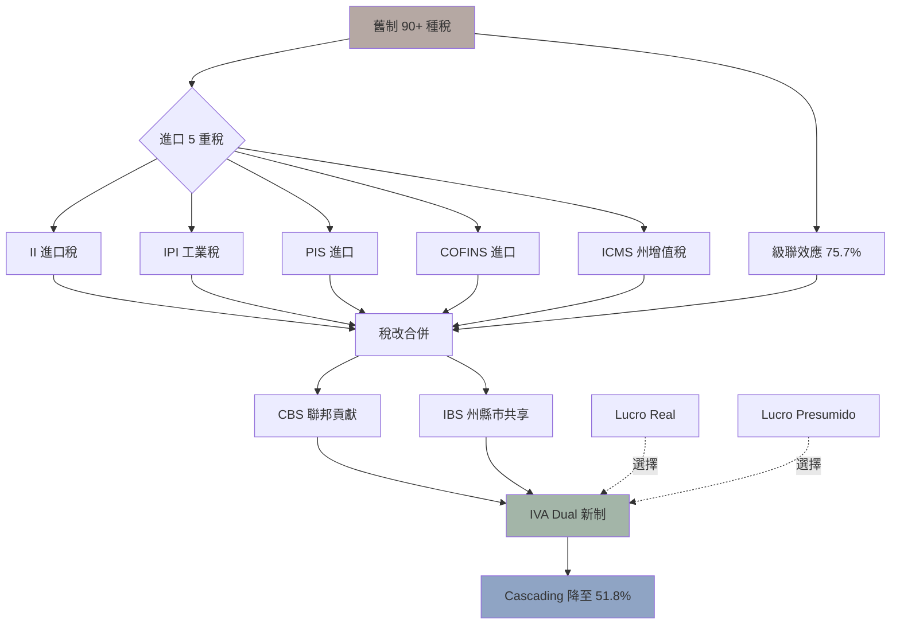

> **因果連接**：在公司成立的第一天，你必須選定稅制——這是不可逆的全年決定。選錯稅制，就像在荆棘叢中選了一條只能前進不能後退的路，代價是整個財年的稅負計算全盤重來。

## 一、為什麼巴西被稱為「稅務瘋人院」？

巴西舊制（2025 年以前）擁有超過 **90 種大小稅捐**，光是進口環節就需要計算五種相互疊加的稅：

| 稅種 | 性質 | 徵收層級 |
|---|---|---|
| II（進口稅） | 關稅 | 聯邦 |
| IPI（工業稅） | 消費稅 | 聯邦 |
| PIS / COFINS | 社會貢獻 | 聯邦 |
| ICMS | 流通稅（含州際） | 州 |
| ISS | 服務稅 | 市 |

其中最棘手的是 ICMS 的「**價內稅（Base por dentro）**」邏輯——稅金本身也被計入計算基數。一批 CIF R$50,000 的貨物，實質稅負率可高達 **75.7%**。

## 二、稅改的因果鏈：為什麼 2026 年是窗口期？

### 2026 年：並行測試期（1% IBS/CBS 啟動）

這年是新舊制「並行」的關鍵第一年：
- **CBS**（聯邦增值稅）開始以 0.9% 試行，取代 PIS/COFINS。
- **IBS**（州市增值稅）以 0.1% 試行，取代 ICMS/ISS。
- **Split Payment（分裂支付）** 機制首次亮相——客戶付款當下，稅款即刻被系統截流匯給國庫。

> **💡 先行者優勢**：2026 年的新制稅率僅 1%，是建立系統合規流程的黃金窗口。提前做好 ERP 對接，等到 2027 年 CBS 全面啟動時，你已胸有成竹。

### 2027～2032 年：逐步切換

PIS、COFINS、IPI（非 ZFM 區）逐年退出歷史舞台。

### 2033 年：新制完全體

- 舊制五稅 **全部廢除**。
- CBS + IBS 合計稅率預計約 **26.5%**（價外稅）。
- 同批貨物的實質稅負率：**51.8%**（較舊制降低 12.5%）。

---

## 三、企業稅制的不可逆選擇：Lucro Real vs. Lucro Presumido

公司在每個日曆年的第一筆稅款繳納時，即視為確認了當年度的稅制選擇，**全年不可撤回**。

### Lucro Presumido（推定利潤制）

適合年營收 **低於 R$7,800 萬**、利潤較高且帳務較簡單的企業。

- IRPJ 基數：商貿活動 **8%**；一般服務 **32%**
- CSLL 基數：商貿活動 **12%**；一般服務 **32%**
- 優點：無須複雜會計記帳
- 缺點：進項稅金（進口繳納的 IPI/PIS/COFINS）**無法抵扣**

### Lucro Real（實際利潤制）

以企業的**真實應稅利潤**作為基數計算。**跨境電商進入巴西的初期強烈推薦選擇此制**，原因如下：

1. **進項稅金可全額抵扣**：新制的 CBS/IBS 採非累積制，在 Lucro Real 下，進口繳納的稅金可完整抵減當季銷項稅，直接降低現金流壓力。
2. **虧損可跨年結轉**：創業初期通常會有先期虧損，Lucro Real 允許將虧損結轉至最多 30% 的未來利潤，有效降低未來稅負。
3. **面對 Split Payment 的緩衝**：當銷售額猛增，Split Payment 系統會即刻截走大量現金，而進項稅金抵扣權能作為流動性緩衝。
4. **長期財務透明度**：吸引未來的外部融資或合作夥伴時，Lucro Real 的帳冊更具公信力。

---

## 四、互動決策工具：你應該選擇哪種稅制？

  

    🧮
    <h3 class="quiz-title">稅制選擇問卷：Lucro Real vs. Lucro Presumido</h3>
    問題 1 / 5
  

  

    
你的公司預計年營收規模是多少？

    

      <button class="quiz-option" data-value="0" data-question="0">低於 R$4,800 萬（Simples Nacional 資格）</button>
      <button class="quiz-option" data-value="1" data-question="0">R$4,800 萬 ~ R$7,800 萬（Lucro Presumido 資格）</button>
      <button class="quiz-option" data-value="2" data-question="0">超過 R$7,800 萬（必須 Lucro Real）</button>
    

  

  

    <h4 class="quiz-result-title" id="result-title"></h4>
    

    <button class="quiz-restart" onclick="restartQuiz()">重新測驗</button>
  

---

## 四-2、稅制稅額即時對比計算器

  

    <h4 class="compare-title" style="color:#34d399;">💰 Lucro Real（實際利潤制）</h4>
    

      <label class="compare-input-label">年營收（R$）</label>
      <input class="compare-input" id="real-revenue" type="text" value="5.000.000" placeholder="5.000.000" inputmode="numeric">
    

    

      <label class="compare-input-label">年成本（R$）</label>
      <input class="compare-input" id="real-cost" type="text" value="3.500.000" placeholder="3.500.000" inputmode="numeric">
    

    

      <label class="compare-input-label">年進口稅金（R$）</label>
      <input class="compare-input" id="real-import-tax" type="text" value="300.000" placeholder="300.000" inputmode="numeric">
    

    

      
應稅利潤-

      
IRPJ (15%)-

      
IRPJ 附加 (10%)-

      
CSLL (9%)-

      
進口稅金抵扣-

      
總稅負-

    

  

  

    <h4 class="compare-title" style="color:#60a5fa;">📊 Lucro Presumido（推定利潤制）</h4>
    

      <label class="compare-input-label">年營收（R$）</label>
      <input class="compare-input" id="pres-revenue" type="text" value="5.000.000" placeholder="5.000.000" inputmode="numeric">
    

    

      <label class="compare-input-label">行業類型</label>
      <select class="compare-input" id="pres-type">
        <option value="commerce">商貿活動（推定利潤 8%）</option>
        <option value="service">一般服務（推定利潤 32%）</option>
      </select>
    

    

      
推定利潤基數-

      
IRPJ (15%)-

      
IRPJ 附加 (10%)-

      
CSLL (9%)-

      
進口稅金抵扣不可抵扣

      
總稅負-

    

  

---

## 五、2033 年後企業依然需要繳納 IRPJ + CSLL

許多人誤以為稅改後萬事大吉。**事實是**：2033 年廢除的只是「消費稅（間接稅）」，企業所得稅體系**依然完整運作**：

| 類別 | 稅種 | 2033 年狀態 |
|---|---|---|
| 消費稅（新制） | CBS + IBS | 100% 運行，約 26.5% |
| 所得稅（維持） | IRPJ + CSLL | 繼續徵收 |
| 進口關稅（維持） | II | 維持不變 |
| 舊消費稅（廢除） | PIS, COFINS, ICMS, ISS | 完全廢除 |

---

## 六、[關鍵決策] 你的選擇清單

在進入下一章（設立公司）之前，請確認以下決策：

- [ ] 我的年營收是否低於 R$7,800 萬？（如低於，方有資格選 Lucro Presumido）
- [ ] 我的進口貨物是否需要大量稅金抵扣？（如是，應選 Lucro Real）
- [ ] 我是否已聘用可出具 Lucro Real 記帳服務的在地會計師？
- [ ] 我是否了解 Split Payment 對現金流的即時影響並已規劃應對？

完成上述確認後，方可前往下一章：**設立外資公司（CNPJ 申請與 Pre-acordo 策略）**。

## 流程圖

