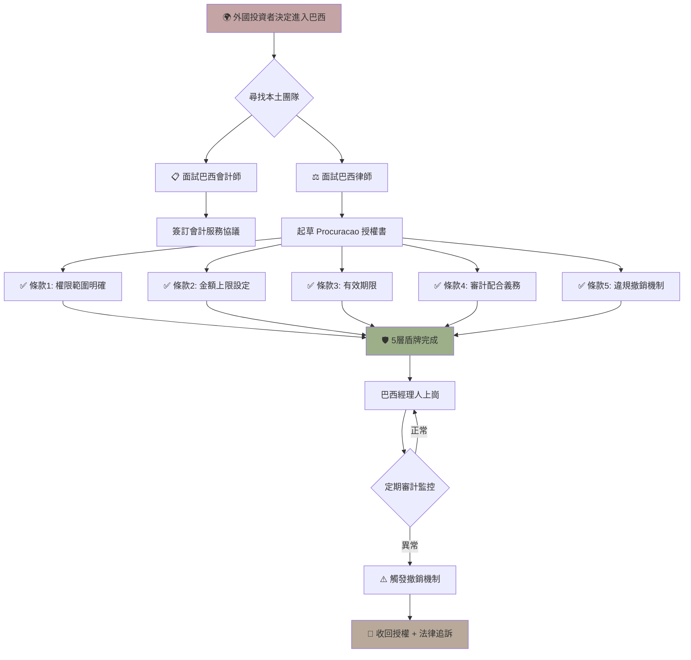

> **因果連接**：你在巴西的合規命運，掌握在你選擇的會計師與律師手中。選錯人，不僅公司設立延期，更可能在稅務申報、授權管理上埋下定時炸彈。選對了，他們就是你的護城河。

## 一、為什麼你需要在地領路人？

巴西的法律與稅務體系是**全球最複雜的之一**，涉及聯邦、州、市三層法規，且各州稅率、申報格式、截止日期各不相同。外資公司如果試圖「DIY」，幾乎必然觸雷。

你需要兩位關鍵角色：

1. **會計師（Contador）**：負責稅務申報、財務記帳、CNPJ 維護、RADAR 財力證明。
2. **律師（Advogado）**：負責公司章程、合約審閱、授權書擬定、勞動法合規。

---

## 二、如何篩選會計師？

### 必備條件

| 條件 | 說明 |
|---|---|
| CRC 註冊 | 必須持有有效的 CRC（Conselho Regional de Contabilidade）執照 |
| 外資經驗 | 至少有服務外資公司（Empresa com Capital Estrangeiro）的經驗 |
| Lucro Real 專業 | 熟悉實際利潤制的記帳與申報流程 |
| 數位能力 | 能操作 SPED 系統、NF-e 電子發票平台 |
| 英語/中文溝通 | 至少能用英語進行基本溝通（或透過翻譯） |

### 面試問題清單

1. 「你服務過多少家外資電商公司？他們主要進口什麼產品？」
2. 「你如何處理 Split Payment 機制下的稅務申報？」
3. 「Lucro Real 下，進口繳納的 CBS/IBS 如何抵扣？請說明流程。」
4. 「如果公司被稅局列入 Malha Fiscal（稅務審查網），你如何應對？」
5. 「你的月度服務費包含哪些項目？額外服務如何計費？」

### 市場行情參考

| 服務類型 | 月度費用（BRL） |
|---|---|
| 基礎記帳 + 稅務申報 | R$1,500 ~ R$3,000 |
| Lucro Real 全套服務 | R$3,000 ~ R$8,000 |
| RADAR 財力證明出具 | R$500 ~ R$1,500（單次） |
| 年度財務報表審計 | R$5,000 ~ R$15,000 |

> **💡 警惕**：報價過低的會計師（如月費低於 R$1,000 卻承諾全套 Lucro Real 服務）通常意味著服務質量堪憂。在巴西，**合規成本是保護費，不是浪費**。

---

## 三、如何篩選律師？

### 必備條件

| 條件 | 說明 |
|---|---|
| OAB 註冊 | 必須持有有效的 OAB（Ordem dos Advogados do Brasil）執照 |
| 公司法專長 | 熟悉外商投資法、公司章程起草 |
| 國際貿易經驗 | 了解 RADAR、進口合約、倉儲合約 |
| 勞動法知識 | 能處理本地員工聘用、管理員委任合約 |

### 關鍵服務項目

1. **公司章程（Contrato Social）起草與公証**
2. **Pleno Poder 授權書擬定與風險約束**
3. **《行政管理員職責限制協議》起草**
4. **3PL 倉儲合約審閱**
5. **電商平台註冊法律文件準備**

---

## 四、Pleno Poder 全權授權書：最大風險源

### 什麼是 Pleno Poder？

**Pleno Poder** 是一份「全權委託書」，授予被授權人（通常是 Administrador）在法律上代表公司進行**所有民事與商業行為**的權力。一旦簽署，被授權人可以：

- 簽署任何合約
- 動用銀行帳戶
- 代表公司出庭
- 處分公司資產
- 申請貸款或擔保

### 風險場景模擬

> **場景**：外資股東 A 先生在巴西境外，委任巴西籍 B 先生擔任公司管理員並簽署 Pleno Poder。六個月後，A 先生發現 B 先生以公司名義向銀行貸款 R$200,000，並將資金轉入個人帳戶。此時公司帳戶被凍結，A 先生必須透過漫長的法律程序才能撤換 B 先生。

### 防護網：五道防線

#### 防線 1：職責限制協議（Acordo de Limitação de Poderes）

這是一份**私下簽署的補充協議**，與 Pleno Poder 同時簽署，但效力優先於授權書的寬泛表述。內容應包含：

| 條款 | 內容 |
|---|---|
| 財務上限 | 單筆支出超過 R$X,000 需海外股東書面批准 |
| 禁止事項 | 不得抵押資產、不得申請貸款、不得簽署競業合約 |
| 報告義務 | 每月提交財務報表與銀行對帳單 |
| 競業禁止 | 任職期間及離職後 2 年內不得從事同行業 |
| 賠償責任 | 因故意或重大過失造成的損失，管理員個人賠償 |

#### 防線 2：銀行雙簽制度

在公司銀行帳戶設定**雙重簽署要求**——任何超過設定金額的轉帳必須由海外股東（透過電子授權）與在地管理員共同確認。

#### 防線 3：隨時撤銷權（Revogação ad nutum）

在公司章程中明確規定：股東可**在任何時候、無條件、無需說明理由**地撤銷管理員的授權。這確保你不會被「綁架」。

#### 防線 4：定期審計

每季度委任獨立會計師進行財務審計，確保所有交易合規。

#### 防線 5：備份管理員

在公司章程中指定一位**備份管理員（Administrador Substituto）**，當主要管理員被撤換時，備份人可立即接任，避免公司運營中斷。

---

## 五、牽制與授權的平衡藝術

| 過度授權 | 平衡點 | 過度牽制 |
|---|---|---|
| 管理員權力不受約束 | 明確的財務上限 + 定期報告 | 每筆支出都需審批 |
| 無備份機制 | 備份管理員 + 隨時撤銷權 | 管理員無法做任何決策 |
| 無審計機制 | 季度獨立審計 | 每月外部審計（成本過高） |

**核心原則**：授權是必要的，但牽制是保險。兩者缺一不可。

---

## 六、[關鍵決策] 在地團隊選擇清單

- [ ] 會計師是否持有有效 CRC 並有外資服務經驗？
- [ ] 律師是否持有有效 OAB 並熟悉外商投資法？
- [ ] 是否已與會計師確認月度服務範圍與費用？
- [ ] 《職責限制協議》是否已由律師草擬並包含全部五道防線？
- [ ] 銀行帳戶是否已設定雙簽制度？
- [ ] 公司章程是否包含備份管理員條款？
- [ ] 是否已建立季度審計機制？

完成在地團隊組建與授權防護後，你已具備了安全落地的基礎——下一步是正式啟動公司設立流程！

## 流程圖

