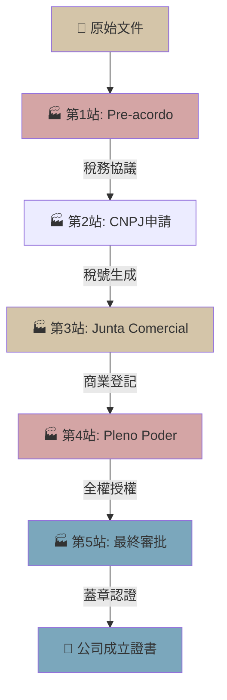

> **因果連接**：公司地址決定了所屬州，而所在州的稅率將影響未來每一筆跨州訂單。因此，在申請 CNPJ 之前，必須先與目標倉庫完成預約，確保登記地址與未來物流策略完美對齊。

## 一、Pre-acordo 策略：用倉庫地址先行登記公司

巴西的 **Inscrição Estadual（州商業登記）** 規定，公司必須有真實可驗的商業地址。許多外資在登記時面臨「雞蛋相生」的困境：沒有公司就無法簽倉庫合約，沒有地址就無法登記公司。

### 解決方案：Pre-acordo（預先約定協議）

1. **聯繫目標 3PL 倉庫**，說明你正在籌備成立一家外資進口公司，計畫在 CNPJ 批准後正式簽署倉儲服務合約。
2. **簽署一份 Pre-acordo 預約書**，約定：
   - 倉庫同意為你的公司預留一個符合法規要求的辦公/商業地址（通常是倉庫辦公室的一個掛牌地址）。
   - 此地址可供公司章程（Contrato Social）使用。
   - 待 CNPJ 正式批下來、Inscrição Estadual 辦妥後，雙方以**法人名義**正式簽署倉儲服務合約。
3. 這是業界通行的合法做法，不構成虛假地址，因為合約明確規定了後續的商業用途。

---

## 二、CNPJ 申請五步驟

| 步驟 | 行動 | 負責人 | 預估時間 |
|---|---|---|---|
| 1 | 委任在地律師，準備公司章程（Contrato Social）草稿 | 母公司 + 律師 | 1~2 週 |
| 2 | 至 Junta Comercial（商業登記局）完成公司章程公証登記 | 律師 | 3~5 工作天 |
| 3 | 向聯邦稅局（RFB）申請 CNPJ 號碼 | 律師代辦 | 1~3 工作天 |
| 4 | 向州稅務局申請 Inscrição Estadual（進行跨州貿易必備） | 律師代辦 | 2~4 週 |
| 5 | 銀行帳戶開立（需持有 CNPJ + Contrato Social 認証本） | 法定代表人親赴或授權 | 1~2 週 |

> **⚠️ 致命關卡**：在銀行帳戶開立後，**不可立即從國外匯款**。你必須先完成下一節所述的中央銀行 (BACEN) RDE-IED 申報，並取得批准後，才能進行實際匯款。

---

## 三、BACEN 申報先行：RDE-IED 的不可逾越紅線

外資投入巴西公司的資本，法律上屬於「**外資直接投資（Investimento Estrangeiro Direto）**」，必須向巴西中央銀行的 **RDE-IED（Registro Declaratório Eletrônico - Investimento Estrangeiro Direto）** 系統進行事前申報。

### 申報流程

1. 透過 SISBACEN 系統或委任授權代理，提交外資投資申報。
2. 申報內容必須包含：`投資金額`、`幣別`、`目的（增資/設立）`、`投資方式（匯款）`
3. 取得**申報受理確認碼（Número de RDE-IED）**。

### 匯款的「一致性」鐵律

**實際匯款的金額、幣別、目的，必須與 RDE-IED 申報內容完全一致。** 任何偏差（哪怕只是金額差了幾美元），都可能導致：
- 資金被銀行攔截，等待 BACEN 審查。
- 被認定為「未登記外資」，無法享有法定的資金匯出保護。
- 未來的利潤匯回（Remessa de Lucros）合法性受到質疑。

---

## 四、資本額精算：讓數字符合稅局「常理」

公司的**資本額（Capital Social）**不僅決定法律責任，也是稅務局評估公司是否「合乎常理」的重要指標。

### 精算公式

先計算前 6 個月的預估支出，作為基礎資本金額的最低線：

| 費用項目 | 預估金額（BRL） | 備註 |
|---|---|---|
| 公司設立與法律費用 | 15,000 ~ 30,000 | 律師、公証、登記費 |
| RADAR 申請（進出口資質） | 包含在律師費中 | 需提供財力證明 |
| 首批進口貨物的關稅與清關費 | 依貨值而定 | 通常佔貨值 40%~80% |
| 倉儲先期費用（3~6 個月） | 10,000 ~ 30,000 | 視倉庫地點而定 |
| 電商平台開店費用 | 5,000 ~ 15,000 | 廣告、內容本地化 |
| 薪資（本地行政人員） | 20,000 ~ 40,000/month | 如有聘用 |
| 流動資金緩衝 | 50,000+ | Split Payment 截流備用 |

**建議資本額在 USD 150,000 ~ USD 300,000 之間**，具體依業務規模調整。

> **💡 稅局「常理」原則**：若你宣稱是一家打算大量進口的電商公司，卻只有 R$10,000 的資本，稅局可能認定這是空殼公司（Empresa de Fachada），觸發調查。資本額必須與業務計畫書（Plano de Negócios）的規模相符。

---

## 五、Pleno Poder：授權的藝術與防護

由於外資股東人在海外，必須授予在地管理員（Administrador）充分的法律授權才能日常運作。**Pleno Poder（全權授權書）**一旦簽署，管理員在法律上幾乎可以代表公司做任何事——這是你最大的法律風險之一。

### 必須簽署的配套約束合約

**在公司章程之外，額外簽署一份私下的《行政管理員職責限制協議（Acordo de Limitação de Poderes do Administrador）》**，內容應包含：

1. **財務動支雙簽制**：單筆超過 R$X,000 的資金動支，必須取得海外股東（母公司）的書面授權。
2. **禁止抵押/處置公司資產**：管理員無權將任何公司資產作為擔保或進行處置。
3. **競業禁止條款**：管理員職務期間及離職後兩年內，不得在同行業成立競業公司。
4. **隨時終止條款 (Revogação ad nutum)**：股東可在任何時候無條件撤銷授權，無需說明理由。
5. **職務賠償責任（Responsabilidade por Danos）**：管理員因故意或重大過失造成的損失，須個人賠償。

---

## 六、[關鍵決策] 本章決策清單

- [ ] 已鎖定目標 3PL 倉庫，並與其簽署 Pre-acordo？
- [ ] 已選定代辦律師，開始準備 Contrato Social？
- [ ] 已計算好合理的資本額並獲得母公司董事會授權？
- [ ] RDE-IED 申報是否已在匯款前完成並取得確認碼？
- [ ] 管理員《職責限制協議》是否已由律師草擬並由各方簽署？

完成所有確認後，恭喜你——你的公司即將有了法律生命，下一步是打通資金血脈並入駐電商平台！

## 3. Mermaid 流程圖

