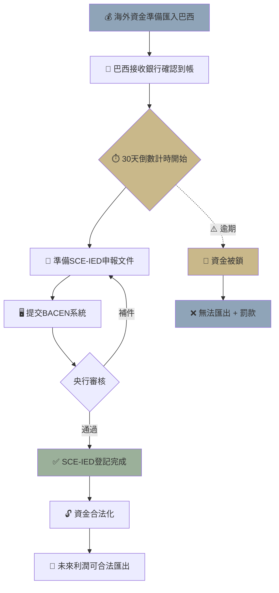

> **因果連接**：資金是公司的血液，但巴西的中央銀行（BACEN）是心臟瓣膜——血液必須按照正確的通道流動。如果在匯款前未完成 SCE-IED (RDE-IED) 登記，你的資金將被卡在海關或退回，公司將因缺血而死亡。

## 一、為什麼 BACEN 申報是「致命關卡」？

許多外資犯下了一個**不可逆的錯誤**：公司成立、銀行帳戶開立後，立刻從境外匯入資金。他們以為這是正常的商業操作，但在巴西法律下，**未經 BACEN 登記的外資匯款不享有法定的資金保護**。

### 後果

- 資金可能被銀行攔截，等待 BACEN 審查（耗時數週至數月）。
- 被認定為「未登記外資」，未來**無法合法匯出**（包括利潤匯回）。
- 稅務局可能將該筆資金視為「隱性收入」，課徵 IRPJ + CSLL。

> **⚠️ 央行警告**：SCE-IED (RDE-IED) 登記必須在**實際匯款之前**完成。匯款後補登記不僅程序複雜，且可能被認定為違規操作。

---

## 二、SCE-IED (RDE-IED) 系統完整操作指南

### 什麼是 SCE-IED (RDE-IED)？

**SCE-IED（Sistema de Prestação de Informações de Capital Estrangeiro de Investimento Estrangeiro Direto）** 是巴西中央銀行的電子申報系統，用於登記所有外資直接投資。它是舊制 RDE-IED（Registro Declaratório Eletrônico）的升級版，依據 **Lei 14.286/2021**（新外資框架法）和 **Resolução BCB 278/2022** 規範。

### 2024 年 10 月重大變化：30 天規則取消

2024 年 10 月 1 日起，巴西取消了「變動後 30 天內更新」的嚴格限制，改為依據公司規模進行**定期申報（Declarações Periódicas）**。這意味著你不再需要每次資本變動都立即更新，而是在定期申報窗口內統一更新。

### 定期申報門檻

| 申報類型 | 門檻 | 截止日期 |
|----------|------|---------|
| **年度申報（Anual）** | 資產總額 ≥ R$1 億 | 次年 1 月 1 日 ~ 3 月 31 日 |
| **季度申報（Trimestral）** | 資產總額 ≥ R$3 億 | 每季結束後規定期限內 |
| **五年申報（Quinquenal）** | 淨資產 ≥ US$1 億 | 7 月 1 日 ~ 8 月 15 日（年份末位 0 或 5） |

### 申報五步驟

| 步驟 | 行動 | 負責人 | 預估時間 |
|---|---|---|---|
| 1 | 使用 gov.br 帳號（銀級/金級）登入 SCE-IED 系統 | 法定代表人或 Mandatário | 即時 |
| 2 | 提交外資投資申報：金額、幣別、目的、投資方式 | 法定代表人或代理 | 3~5 工作天 |
| 3 | BACEN 審核申報內容（形式審查） | BACEN | 5~10 工作天 |
| 4 | 取得 SCE-IED (RDE-IED) 受理確認碼（Número de Protocolo） | 系統自動 | 即時 |
| 5 | 憑確認碼進行實際匯款 | 母公司財務 | 1~3 工作天 |

### 申報必填欄位

  

    📋
    <h4 class="fields-card-title">SCE-IED (RDE-IED) 申報必填欄位</h4>
  

  

    

      投資人類型
      Pessoa Jurídica Não Residente（境外法人）
    

    

      投資金額
      USD 或 BRL（建議以 USD 申報）
    

    

      投資目的
      Constituição de Empresa / Aumento de Capital
    

    

      投資方式
      Transferência Bancária（銀行匯款）
    

    

      被投資公司 CNPJ
      已取得的 CNPJ 號碼
    

    

      投資日期
      預計匯款日期
    

  

### gov.br 帳號集成

2026 年起，SCE-IED 系統已與 **gov.br** 單一登錄門戶高度集成。法定代表人可使用 gov.br 帳號（銀級或金級安全等級）直接登入系統進行申報，無需再透過 SISBACEN 複雜操作。你也可以授權 Mandatário（受託代表人）代為操作。

---

## 三、匯款的「一致性」鐵律

**實際匯款的金額、幣別、目的代碼，必須與 SCE-IED (RDE-IED) 申報內容完全一致。**

### 一致性檢查清單

| 欄位 | 申報內容 | 匯款水單 | 是否一致？ |
|---|---|---|---|
| 金額 | USD 200,000 | USD 200,000 | ✅ |
| 幣別 | USD | USD | ✅ |
| 目的代碼 | 101 - Constituição | 101 - Constituição | ✅ |
| 收款公司 CNPJ | XX.XXX.XXX/0001-XX | XX.XXX.XXX/0001-XX | ✅ |
| 匯款日期 | 2026-04-15 | 2026-04-15 | ✅ |

**任何不一致都可能觸發以下後果**：

1. **銀行端攔截**：收款銀行發現水單與 SCE-IED (RDE-IED) 登記不符，將資金暫扣並要求解釋。
2. **BACEN 審查**：需提交補充說明，耗時 2~4 週。
3. **資金退回**：最壞情況下，資金被退回匯出銀行，匯款手續費白費。

> **💡 實務建議**：匯款金額建議比申報金額**少匯 1%~2%**（用於覆蓋銀行手續費），而非多匯。多匯的差額將被視為未登記外資。

---

## 四、資本額精算：前半年營運費用模型

公司的**資本額（Capital Social）**必須合理反映業務規模。以下是標準的跨境電商前半年營運模型：

### 基礎營運費用（6 個月）

| 費用項目 | 月度（BRL） | 6 個月合計 | 備註 |
|---|---|---|---|
| 會計師服務費 | R$3,000 ~ R$8,000 | R$18,000 ~ R$48,000 | Lucro Real 全套 |
| 律師顧問費 | R$2,000 ~ R$5,000 | R$12,000 ~ R$30,000 | 合規諮詢 |
| 倉儲費用 | R$5,000 ~ R$15,000 | R$30,000 ~ R$90,000 | 3PL 基礎服務 |
| 薪資（1 名本地行政） | R$5,000 ~ R$8,000 | R$30,000 ~ R$48,000 | 含福利稅 |
| 電商平台費用 | R$2,000 ~ R$5,000 | R$12,000 ~ R$30,000 | 廣告 + 平台佣金 |
| 水電/通訊/軟體 | R$1,000 ~ R$3,000 | R$6,000 ~ R$18,000 | 基礎運營 |
| **小計** | | **R$108,000 ~ R$264,000** | |

### 一次性費用

| 費用項目 | 金額（BRL） | 備註 |
|---|---|---|
| 公司設立法律費用 | R$15,000 ~ R$30,000 | 律師 + 公証 + 登記 |
| RADAR 申請 | R$5,000 ~ R$10,000 | 含律師代辦費 |
| 產品認証（首批） | R$20,000 ~ R$80,000 | INMETRO/ANATEL/ANVISA |
| ERP 系統導入 | R$10,000 ~ R$30,000 | 一次性設置費 |
| **小計** | **R$50,000 ~ R$150,000** | |

### 首批進口貨物資金

| 項目 | 金額（BRL） | 備註 |
|---|---|---|
| 貨物 CIF 價值 | R$100,000 ~ R$500,000 | 依產品而定 |
| 進口稅費（約 CIF 的 60%~80%） | R$60,000 ~ R$400,000 | II + IPI + PIS + COFINS + ICMS |
| 清關與物流 | R$10,000 ~ R$30,000 | Despachante + 運輸 |
| **小計** | **R$170,000 ~ R$930,000** | |

### 建議資本額

**總計：R$328,000 ~ R$1,344,000（約 USD 65,000 ~ USD 270,000）**

> **💡 稅局「常理」原則**：資本額必須與業務計畫書的規模相符。建議最低 **USD 150,000**，理想範圍 **USD 200,000 ~ USD 300,000**。

---

## 五、資金匯入後的下一步

資金合規匯入後，你的公司有了真正的「血液」。接下來：

1. **確認銀行帳戶餘額**與匯款水單一致。
2. **會計師入帳**：將外資投資記錄為「Capital Social」。
3. **保存 SCE-IED (RDE-IED) 登記文件**：這是未來利潤匯出的唯一合法憑證。
4. **準備入駐電商平台**：使用 CNPJ + 銀行帳戶 + 資本證明註冊。

---

## 六、[關鍵決策] 資金合規清單

- [ ] SCE-IED (RDE-IED) 申報是否已在匯款前完成並取得確認碼？
- [ ] 匯款金額、幣別、目的代碼是否與申報完全一致？
- [ ] 資本額是否已涵蓋前 6 個月營運費用 + 首批進口資金？
- [ ] 會計師是否已準備好外資投資入帳憑證？
- [ ] SCE-IED (RDE-IED) 登記文件是否已妥善存檔（數位 + 紙本）？
- [ ] 我是否了解 2024 年 10 月起 30 天規則已取消，改為定期申報？
- [ ] 我是否已確認公司的定期申報類型（年度/季度/五年）？

完成資金合規注入後，你的公司已經具備了運營的血液——下一步是入駐主流電商平台，開始銷售！

## 3. Mermaid 流程圖

