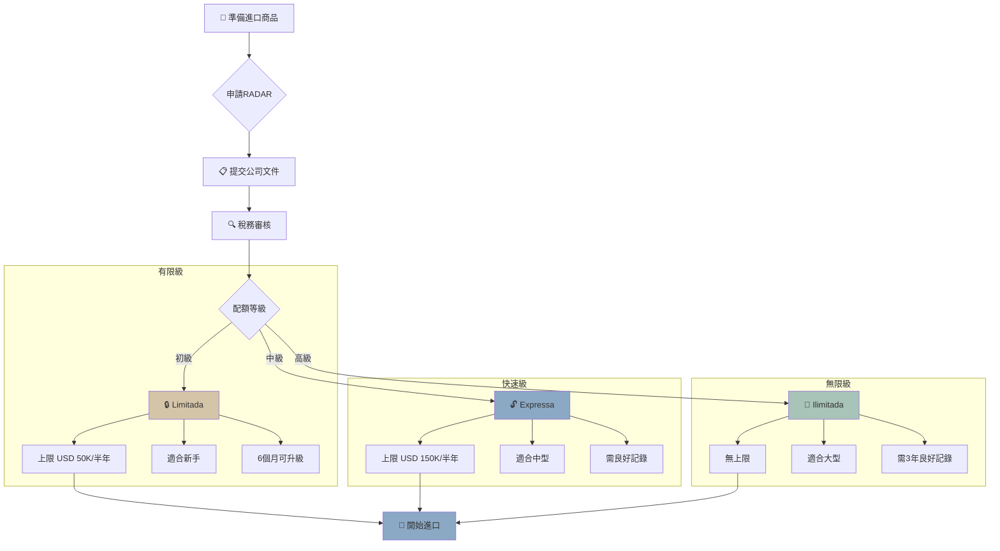

> **因果連接**：貨物進口巴西必須先有 RADAR 進出口資格——這是你的「進場門票」。同時，商品本身必須持有對應的強制認證，否則貨物在港口被扣押退運的代價遠遠超出申請費用。

## 一、RADAR 是什麼？為什麼必須先申請？

**RADAR（Radar Siscomex）** 是巴西聯邦稅局（RFB）對外貿企業進行進出口操作前，必須完成的資格審核與授權系統。沒有 RADAR，你的公司無法在 Siscomex（巴西電子海關系統）中進行任何進出口申報操作。

### RADAR 的三種等級

| 等級 | 適用條件 | 半年進口上限（美元） |
|---|---|---|
| **Limitado** | 中小型公司、財力有限但商業合規 | USD 150,000 |
| **Ilimitado** | 已進口一定規模、財力充裕 | 無上限 |
| **Expresso** | MEI / 低風險特定行業 | 最低額 |

新成立的外資公司通常先申請 **RADAR Limitado**，待業務規模增長後升級為 Ilimitado。

---

## 二、哪些資料是新公司申請 RADAR 的關鍵？

聯邦稅局在審核 RADAR 申請時，核心在於評估「**公司是否具備真實進行國際貿易的財力與合規性**」。

### 必備文件清單

1. **CNPJ 有效、無負債記錄（Certidão Negativa de Débitos）**
2. **公司章程（Contrato Social）公証本**
3. **法定代表人的 CPF（個人稅號）和 RNE/CIE（外籍居留證）**
4. **財力證明文件**（以下任一種）：
   - 銀行存款餘額證明（最低 BRL 150,000 ~ BRL 500,000，視貿易規模而定）
   - 已完成的 RDE-IED 外資投資登記確認書（符合資本額要求）
   - 母公司的資產負債表及會計師認証
5. **業務說明書（Declaração de Atividade）**：說明進口商品類型、供應商國家與預計進口金額。
6. **已有效的 Inscrição Estadual（州商業登記）**

> **⚠️ 常見拒件原因**：公司剛成立，帳戶餘額接近零，又未能提交母公司擔保函或外資投資文件。建議在資本匯入完成後再提交 RADAR 申請。

---

## 三、產品進口資質：你的貨必須先「拿到准許證」

巴西是世界上對進口產品管制最嚴格的國家之一。以下是各類商品的強制認證機構：

### 🔌 電子電氣產品：INMETRO + ANATEL

**INMETRO（巴西國家度量衡質量與技術研究院）**
- 針對所有電器、電子消費品，需要取得 **OCP 認証**（通過認可機構的安全合規測試）。
- 常見測試標準：ABNT NBR 系列，等同 IEC 國際標準。
- 流程：授權代理 → 送樣測試 → 取得認証碼 → 登記 INMETRO 資料庫。

**ANATEL（巴西國家電信局）**
- 任何含有無線通訊功能的產品（Wi-Fi、藍牙、5G、GPS）必須取得 ANATEL 同質性聲明（Certificado de Homologação）。
- 未取得 ANATEL 認証的搜索棒、藍牙耳機等，在清關時直接被沒收。

### 🧴 美容、食品、補充品：ANVISA

**ANVISA（巴西國家衛生監督局）**
- 化妝品（Cosméticos）：低風險可免預先審批，但需進口商在巴西持有進口商登記（Responsável Técnico）。
- 醫療器材與補充品：需提前申請 AFE（Autorização de Funcionamento de Empresa）與產品登記（Registro de Produto）。
- 食品進口：需出口國的衛生證明附隨貨物。

### 🐾 **寵物與農產品：MAPA（巴西農業部）**——最難啃的一塊

**MAPA（Ministério da Agricultura, Pecuária e Abastecimento）** 負責農漁產品、動植物衍生品及寵物相關商品的管制。

**涵蓋的產品類型**：
- 寵物食品（干糧、零食、保健品）
- 寵物藥品、疫苗
- 寵物項圈（含農藥成分的驅蟲項圈）
- 寵物飼料與天然補充品

**MAPA 申請流程**：
1. 公司必須首先取得 **SIPAG 系統**（農業輸入資訊系統）的企業登記資格。
2. 每批進口產品需提前申請 **AISAM（Autorização de Importação）** 進口許可。
3. 進口的寵物食品必須附帶：
   - 出口國官方衛生機構的**動物健康証書（GTA）**
   - 原料成分及含量的**完整申報（Ficha Técnica）**
4. 抵達巴西港口後，MAPA 官員可能抽驗實物，不合格的直接銷毀不退運。

> **💡 寵物市場機遇**：巴西是全球第三大寵物市場，年市場規模超過 **R$600 億**。然而，正因為 MAPA 門檻高，讓許多外資望而卻步，這反而為有準備的入市者創造了強大的競爭護城河。

---

## 四、選定產品，避開「資質地雷」

**在選品的第一步，就應該同步評估認証成本與時間：**

| 認証類型 | 預估費用 | 預估時間 | 難度 |
|---|---|---|---|
| INMETRO OCP | R$15,000 ~ 50,000 | 3~6 個月 | ★★★ |
| ANATEL 認証 | R$8,000 ~ 25,000 | 2~4 個月 | ★★★ |
| ANVISA 化妝品 | R$5,000 ~ 20,000 | 1~3 個月 | ★★ |
| MAPA 寵物食品 | R$20,000 ~ 80,000 | 6~12 個月 | ★★★★ |

---

## 五、[關鍵決策] 本章決策清單

- [ ] 公司資本已注入，帳戶餘額符合 RADAR Limitado 要求？
- [ ] 已確認選定商品所需的是哪些認証（INMETRO / ANATEL / ANVISA / MAPA）？
- [ ] 供應商是否可提供相關技術文件（Safety Report / EMC Test）以支持認証申請？
- [ ] 是否已委任在地 Despachante Aduaneiro（清關代理）協助申報流程？

完成 RADAR 與產品認証後，你的貨物才有資格踏上巴西這片土地——下一步是選擇能讓貨物最快抵達消費者的 3PL 倉庫！

## 3. Mermaid 流程圖

