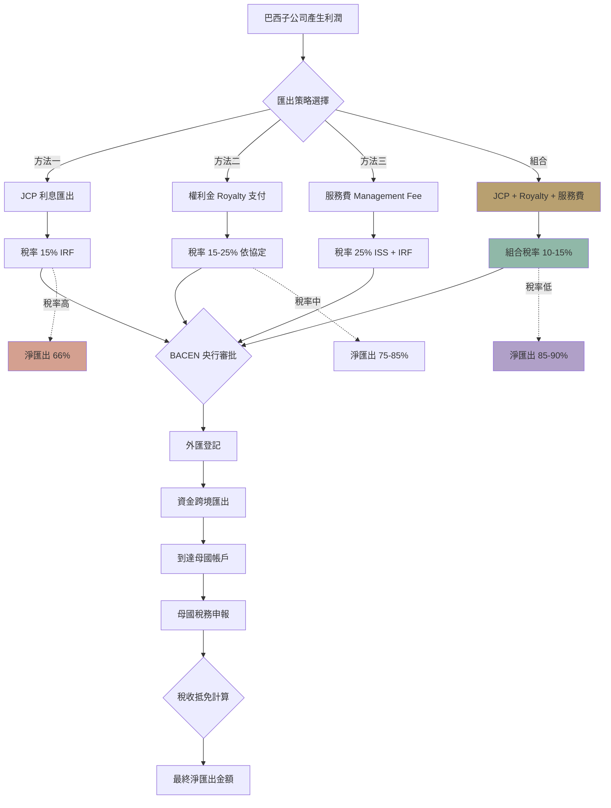

> **因果連接**：你在巴西的業務已經穩定運營，產生了利潤。但利潤留在巴西子公司帳上，對母公司而言只是帳面數字。如何合規、低稅地將利潤匯回？這需要精心的稅務規劃——利用 JCP、特許權使用費等工具，在合法框架內實現利潤的最大化回流。

## 一、利潤匯出的法律框架

### 基本原則

巴西法律允許外資企業將**稅後利潤（Lucros Líquidos）** 匯出至境外母公司，且**利潤匯出本身不徵收預提所得稅（IRRF）**。

但前提是：

1. 利潤必須經過**審計的財務報表**確認。
2. 利潤必須在**年度財務報表（Balanço Patrimonial）** 中明確記錄。
3. 匯出金額**不得超過可分配利潤餘額**。
4. 必須持有**SCE-IED (RDE-IED) 登記文件**（證明外資身份）。

### 利潤匯出流程

  

    🏦
    <h4 class="flow-card-title">利潤匯出流程</h4>
  

  

    

      
1

      

        
年度財務報表審計完成

        
由註冊會計師出具審計報告（Balanço Patrimonial）

      

    

    

      
2

      

        
股東會決議分配利潤

        
股東會通過利潤分配決議，確定匯出金額

      

    

    

      
3

      

        
會計師出具利潤計算證明

        
確認可分配利潤餘額與匯出金額一致

      

    

    

      
4

      

        
銀行提交匯款申請

        
附 SCE-IED (RDE-IED) + 利潤證明，通過銀行匯款至境外帳戶

      

    

    

      
5

      

        
資金匯至母公司境外帳戶

        
通常 1~3 工作天到帳，無預提所得稅（IRRF）

      

    

  

> **💡 核心優勢**：與許多國家不同，巴西的**利潤匯出不徵收 IRRF（預提所得稅）**。這意味著 R$1,000,000 的利潤可以全額匯出，無需額外的匯出稅。

---

## 二、JCP：自有資本利息——最強抵稅工具

### 什麼是 JCP？

**JCP（Juros sobre o Capital Próprio）** 是巴西獨有的稅務工具，允許公司將部分利潤以「利息」的形式支付給股東，且**該利息可在公司層面作為費用抵扣**，從而降低企業所得稅（IRPJ/CSLL）。

### JCP 的稅務優勢

| 層面 | 說明 |
|---|---|
| 公司層面 | JCP 支出可抵扣 IRPJ + CSLL（合計約 34%） |
| 股東層面 | 境外股東需繳納 15% 的 IRRF（預提所得稅） |
| 淨效果 | 公司節省 34%，股東繳納 15%，**淨節省約 19%** |

### JCP 計算公式

  

    📐
    <h4 class="formula-card-title">JCP 計算公式</h4>
  

  

    
JCP 上限 = 淨資產 × TJLP（長期利率）

  

  

    <ul style="margin:0;padding-left:1.25rem;color:var(--color-text-muted);font-size:0.85rem;line-height:1.6;">
      <li><strong style="color:var(--color-neon-green);">TJLP</strong> 由巴西中央銀行每年設定（2024 年約為 5.5%~7.5%）</li>
      <li>JCP 支付金額<strong style="color:var(--color-text);">不得超過</strong>上述上限</li>
      <li>JCP 可以按月、按季或按年支付</li>
    </ul>
  

### JCP 實戰模擬

假設公司淨資產為 BRL 1,000,000，TJLP 為 6%：

| 項目 | 金額 |
|---|---|
| JCP 上限 | BRL 60,000/年 |
| 公司抵扣 IRPJ + CSLL（34%） | 節省 BRL 20,400 |
| 股東繳納 IRRF（15%） | 繳納 BRL 9,000 |
| **淨節省** | **BRL 11,400** |

### JCP 的合規要求

1. 公司章程必須**明確允許** JCP 支付。
2. 必須在**季度財務報表**中計算並記錄。
3. 支付時必須**代扣 15% 的 IRRF** 並按時繳納。
4. 年度財務報表審計時需由會計師確認。

> **⚠️ 注意**：JCP 不能取代正常的利潤分配，而是**額外的稅務優化工具**。公司仍應按正常程序分配稅後利潤。

---

## 三、特許權使用費（Royalties）

### 什麼是特許權使用費？

境外母公司可以向巴西子公司收取**品牌授權費、技術使用費、專利許可費**等，這些費用在巴西子公司層面可作為營業費用抵扣。

### 適用的無形資產類型

| 類型 | 說明 | 稅率上限 |
|---|---|---|
| 商標/品牌授權 | 使用母公司品牌 | 1%~5%（依行業而定） |
| 技術/專利許可 | 使用母公司技術 | 1%~5% |
| 軟體授權 | 使用母公司開發的軟體 | 1%~5% |
| 管理服務費 | 母公司提供的管理諮詢 | 需證明實際服務 |

### 稅務處理

| 層面 | 說明 |
|---|---|
| 公司層面 | 特許權使用費可作為營業費用抵扣 IRPJ + CSLL |
| 匯出層面 | 需繳納 **15% 的 IRRF**（部分國家 DTA 可降至 10%） |
| PIS/COFINS | 需繳納 **9.25%**（Lucro Real 下可抵扣） |
| CIDE | 技術類特許權使用費需繳納 **10% 的 CIDE** |

### 合規要求

1. **書面合約**：必須有正式的授權合約，明確授權範圍、期限、費率。
2. **INPI 登記**：商標/技術授權合約必須在 **INPI（巴西國家工業產權局）** 登記。
3. **公平交易原則**：費率必須符合市場行情，不能過高（否則稅局可能認定為利潤轉移）。
4. **實質服務證明**：管理服務費必須有實際服務記錄（如會議紀要、報告）。

### 特許權使用費 vs. JCP 對比

| 維度 | JCP | 特許權使用費 |
|---|---|---|
| 稅前抵扣 | ✅（IRPJ + CSLL） | ✅（IRPJ + CSLL + PIS/COFINS） |
| 匯出稅 | 15% IRRF | 15% IRRF + 9.25% PIS/COFINS + 10% CIDE（如適用） |
| 合規難度 | 低 | 中（需 INPI 登記） |
| 金額上限 | 有（TJLP × 淨資產） | 無（但需符合公平交易） |
| 適用場景 | 年度利潤分配 | 持續性授權收入 |

> **💡 策略**：**組合使用** JCP + 特許權使用費，可以最大化稅務優化效果。JCP 用於年度利潤分配，特許權使用費用於持續的品牌/技術授權收入。

---

## 四、管理服務費（Assistência Técnica, Administrativa e Financeira）

### 什麼是管理服務費？

境外母公司向巴西子公司提供**管理諮詢、技術支持、財務顧問**等服務，並收取相應費用。

### 合規要點

| 要點 | 說明 |
|---|---|
| 服務合約 | 必須有正式的服務合約，明確服務內容、費率、期限 |
| 實質服務 | 必須有實際服務記錄（報告、會議、郵件） |
| 公平交易 | 費率必須符合市場行情 |
| 發票 | 母公司需开具服務發票（Invoice） |

### 稅務處理

| 稅種 | 稅率 | 備註 |
|---|---|---|
| IRRF | 15%~25% | 依服務類型而定 |
| PIS/COFINS-Importação | 9.25% | Lucro Real 下可抵扣 |
| ISS | 2%~5% | 依城市而定 |
| CIDE | 10% | 僅適用於技術服務 |

---

## 五、利潤匯出的完整策略

### 年度利潤分配計畫

| 工具 | 頻率 | 稅前抵扣 | 匯出稅 | 建議比例 |
|---|---|---|---|---|
| 稅後利潤匯出 | 年度 | 不適用 | 0% | 基礎 |
| JCP | 季度/年度 | ✅ 34% | 15% IRRF | 淨資產的 5%~7% |
| 特許權使用費 | 月度/季度 | ✅ | 15% IRRF + 9.25% PIS/COFINS | 營收的 1%~3% |
| 管理服務費 | 月度 | ✅ | 15%~25% IRRF + 9.25% PIS/COFINS | 依實際服務 |

### 綜合模擬

假設巴西子公司年度稅後利潤為 BRL 2,000,000：

| 工具 | 金額 | 公司抵扣 | 匯出稅 | 母公司實收 |
|---|---|---|---|---|
| 稅後利潤匯出 | BRL 1,000,000 | - | 0% | BRL 1,000,000 |
| JCP（6% × BRL 1M 淨資產） | BRL 60,000 | 節省 BRL 20,400 | 15% IRRF = BRL 9,000 | BRL 51,000 |
| 特許權使用費（2% × BRL 5M 營收） | BRL 100,000 | 節省 BRL 34,000 | 15% IRRF + 9.25% PIS/COFINS = BRL 24,250 | BRL 75,750 |
| **合計** | | **節省 BRL 54,400** | **稅款 BRL 33,250** | **BRL 1,126,750** |

> **💡 淨效果**：通過組合使用 JCP + 特許權使用費，母公司多收到了 **BRL 126,750**，同時巴西子公司節省了 **BRL 54,400** 的企業所得稅。

---

## 六、SCE-IED (RDE-IED) 利潤匯回申報操作

### 匯兌合約與 SCE-IED 代碼連結

所有利潤匯回必須透過巴西授權銀行進行。若匯款金額等於或超過 **USD 100,000**（或等值外幣），銀行在辦理匯兌合約（Contrato de Câmbio）時必須強制輸入該公司的 **SCE-IED (RDE-IED) 代碼**。

一旦匯兌合約結算並連結代碼，該筆交易會自動顯示在 SCE-IED 系統內的「匯兌/TIR（Câmbio/TIR）」分頁中。

### 手動申報要求（門檻規則）

| 匯款金額 | SCE-IED 操作 |
|----------|-------------|
| **≥ USD 100,000** | 必須在系統中進行手動登記：進入「其他變動（Demais movimentações）」→ 選擇「分紅與利潤分配（Distribuição de lucros e de dividendos）」 |
| **< USD 100,000** | 不允許在匯兌合約中填寫 SCE-IED 代碼，無需在系統內進行手動申報 |

### SCE-IED 與 Receita Federal 數據一致性

SCE-IED（中央銀行系統）與 Receita Federal（聯邦稅務局）是**獨立且並行**的兩套系統。若 SCE-IED 的登記數據與提交給稅務局的會計報表不符，將可能觸發行政處分或罰款。

> **⚠️ 最嚴重後果**：若 SCE-IED 登記存在違規或未及時更新，中央銀行有權**掛起（Suspender）**該公司的外商投資操作，導致無法辦理匯兌結算，進而阻塞利潤匯回管道。

### 定期申報與會計年度同步

自 2024 年 10 月起，SCE-IED 改為定期申報制。在進行定期申報時，必須確保 SCE-IED 系統內的以下數據與會計帳簿（Contabilidade）完全一致：

- **資產總額（Ativo Total）** 與 **負債（Passivo）**
- **淨資產（Patrimônio Líquido）**：最關鍵的同步指標
- **實收資本（Capital Integralizado）**
- **利潤分配（Distribuição de Lucros）**

---

## 七、[關鍵決策] 利潤匯出清單

- [ ] 年度財務報表是否已完成審計？
- [ ] 股東會是否已決議利潤分配方案？
- [ ] SCE-IED (RDE-IED) 登記文件是否有效且可查？
- [ ] 公司章程是否允許 JCP 支付？
- [ ] 特許權使用費合約是否已在 INPI 登記？
- [ ] 管理服務費是否有實質服務記錄？
- [ ] 是否已與會計師確認所有匯出稅的計算？
- [ ] 銀行是否已準備好跨境匯款文件？

完成利潤匯出規劃後，恭喜你——你的跨境電商出海巴西之旅已經形成了完整的閉環！從戰略藍圖到利潤收割，每一步都已在你的掌控之中。

## 流程圖

  

